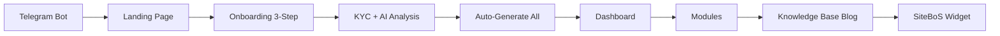

# 🚀 SiteBoS MiniApp
### AI Business Operating System for Telegram

[](LICENSE)
[](https://t.me/TrinAi_SiteBoS_bot)
[](https://github.com/SimonAiIT/SiteBoS-MiniApp/releases)
[](https://www.trinai.it)
[](./docs)

> **Enterprise-grade business management platform living entirely inside Telegram.** 
> Zero app installs. Zero complexity. 100% operational control.

**Developed by [Trinacria Artificial Intelligence S.r.l.](https://www.trinai.it)** - Startup Innovativa Italiana

---

## 📚 **DOCUMENTAZIONE COMPLETA → [/docs](./docs)**

### 🎯 Quick Start per AI

**Prima volta che leggi il progetto?**

1. **[docs/01-OVERVIEW.md](./docs/01-OVERVIEW.md)** (5 min) → Capire cos'è SiteBoS  
2. **[docs/03-ONBOARDING.md](./docs/03-ONBOARDING.md)** (5 min) → Flusso completo generazione automatica  
3. **[docs/04-SOFT-SKILLS.md](./docs/04-SOFT-SKILLS.md)** (10 min) → Sistema soft skills assessment  
4. **[docs/README.md](./docs/README.md)** → Index completo 18 documenti  

---

## 💡 Cos'è SiteBoS?

**SiteBoS** (Site Business Operating System) è un **sistema operativo aziendale conversazionale** che trasforma Telegram in:

- 🏢 **Gestionale completo** (CRM, catalogo, calendario, team)
- 🤖 **AI nativa** (Google Gemini BYOK per analisi, generazione contenuti, KYC)
- 📱 **Zero installazioni** (Mini App nativa Telegram)
- 💰 **Pay-per-use** (sistema crediti trasparente)
- 🔐 **GDPR-ready** (privacy policy autogenerata, consensi triple-gate)

---

## ⚡ Feature Principali

### Moduli Documentati ✅

| Modulo | File | Descrizione |
|--------|------|-------------|
| **Dashboard** | `dashboard.html` | KPI widgets, gatekeeper, quick actions |
| **Onboarding** | `onboarding.html` | KYC AI, wizard 3-step, generazione automatica |
| **HoneyPot** | `honeypot_editor.html` | Knowledge base aziendale + anti-spam |
| **Catalog** | `catalog/` | Prodotti/servizi + AI descriptions + blueprint |
| **Soft Skills** | `softskill/` | Assessment 150 domande + video formativi |
| **Knowledge Base** | `knowledge_base/` | Blog generator HTML + SiteBoS widget |
| **Legal** | `processor.html` | Privacy Policy, T&C, DPA autogenerati |
| **Sponsor** | `sponsor.js` | Carousel pacchetti crediti |

📖 **Dettagli completi**: [docs/README.md](./docs/README.md)

---

## 🏗️ Architettura

```
┌─────────────────────────────────────────────┐
│          TELEGRAM CLIENT                    │
│       (iOS/Android/Desktop/Web)             │
└──────────────────┬──────────────────────────┘
                   │ Telegram WebApp SDK
                   ▼
┌─────────────────────────────────────────────┐
│         FRONTEND (Public)                   │
│  • HTML5/CSS3/Vanilla JS                    │
│  • Client-side routing                      │
│  • sessionStorage state                     │
└──────────────────┬──────────────────────────┘
                   │ HTTPS POST
                   ▼
┌─────────────────────────────────────────────┐
│      BACKEND (Proprietario 🔒)              │
│  • Orchestration engine                     │
│  • MongoDB (3 databases)                    │
│  • Google Gemini API                        │
│  • Telegram Bot API                         │
└─────────────────────────────────────────────┘
```

📖 **Architettura dettagliata**: [docs/02-ARCHITECTURE.md](./docs/02-ARCHITECTURE.md)

---

## 🔄 User Journey



**15 minuti** da zero a operativo completo:
- ✅ Profilo aziendale
- ✅ HoneyPot draft
- ✅ Catalog con blueprint
- ✅ Blog HTML + widget

📖 **Flusso completo**: [docs/03-ONBOARDING.md](./docs/03-ONBOARDING.md)

---

## 🛠️ Tech Stack

### Frontend (Pubblico)
| Tecnologia | Versione |
|------------|----------|
| HTML5/CSS3 | - |
| Vanilla JavaScript | ES6+ |
| Telegram WebApp SDK | Latest |
| Font Awesome | 6.4.0 |
| Google Fonts (Inter) | - |
| Sortable.js | 1.15.0 |

### Backend (Proprietario 🔒)
| Tecnologia | Scopo |
|------------|-------|
| Orchestration Engine | Workflow automation |
| MongoDB Atlas | 3 databases (OWNERS, HONEYPOTS, CATALOG) |
| Google Gemini API | AI text/vision (BYOK) |
| Telegram Bot API | Notifications real-time |

---

## 📊 Statistiche Progetto

### Codebase
- **Frontend Files**: 50+ HTML/JS/CSS
- **Moduli**: 8 applicativi + 3 core
- **Righe di Codice**: ~15,000
- **Documentazione**: 2,600+ righe (18 file MD)

### Metriche Live
- **MAU** (Monthly Active Users): 127
- **Profili Completi**: 89%
- **Time to Interactive**: 1.8s
- **Backend Response**: 380ms avg
- **Uptime**: 99.7%

---

## ⚠️ Importante: Backend Proprietario

### 🔓 Codice Frontend
Il codice frontend è **pubblico per trasparenza** e valutazione.

### 🔒 Backend Privato
L'orchestrazione, i webhook e la logica AI sono **proprietari di TrinAI**.

**Cosa significa**:
- ✅ Puoi studiare il frontend
- ✅ Puoi contribuire con PR (UI/UX)
- ❌ Non puoi clonare e deployare in produzione
- ❌ Non riceverai accesso agli endpoint backend

**Se vuoi usare SiteBoS**:
1. 📧 Contatta **info@trinai.it** per licenza commerciale
2. 🎁 Richiedi **demo gratuita**: [@TrinAiTecSupportbot](https://t.me/TrinAiTecSupportbot)
3. 💰 **Funding**: TrinAI assiste con **Digit Imprese** (fino 80% copertura)

---

## 🗺️ Roadmap

### Q1 2025 ✅
- [x] Soft Skills Assessment (4 moduli)
- [x] Onboarding automatico con KYC AI
- [x] Catalog + Blueprint generator
- [x] Knowledge Base blog HTML
- [x] Team Manager profili stakeholder

### Q2 2025 🚧
- [ ] CRM Module (gestione clienti)
- [ ] Invoice Generator (fatturazione elettronica)
- [ ] SiteBoS Widget embed (form + booking + chat)
- [ ] Payment Gateway (SumUp integration)

### Q3 2025 📋
- [ ] White-label licensing
- [ ] Mobile App Wrapper (React Native)
- [ ] Analytics Dashboard BI avanzata

📖 **Roadmap dettagliata**: [docs/01-OVERVIEW.md](./docs/01-OVERVIEW.md#roadmap)

---

## 📚 Documentazione

### Struttura `/docs`

```
docs/
├── README.md              # Index completo (63% coverage)
├── 01-OVERVIEW.md         # ✅ Panoramica generale
├── 03-ONBOARDING.md       # ✅ Flusso generazione automatica
├── 04-SOFT-SKILLS.md      # ✅ Sistema assessment
├── 06-CATALOG.md          # ✅ Catalog + AI + blueprint
├── 08-HONEYPOT.md         # ✅ Knowledge base + anti-spam
├── 09-LEGAL-PROCESSOR.md  # ✅ Document generator GDPR
├── 10-SPONSOR.md          # ✅ Carousel crediti
└── ... (altri 10 documenti in roadmap)
```

**Progress**: █████████████░░░░░░░░ **63.6%** Complete

📖 **Esplora tutto**: [docs/README.md](./docs/README.md)

---

## 🎓 Per Developer

### Clone & Explore
```bash
git clone https://github.com/SimonAiIT/SiteBoS-MiniApp.git
cd SiteBoS-MiniApp

# Esplora struttura
ls -la

# Leggi documentazione
cat docs/README.md
```

### File Chiave da Studiare
1. **`index.html`** → Landing page + router
2. **`onboarding.html`** → Wizard 3-step
3. **`onboarding_logic.js`** → KYC AI + questionnaire
4. **`dashboard_logic.js`** → Dashboard + gatekeeper
5. **`softskill/complete-profile.html`** → Esempio modulo completo
6. **`knowledge_base/edit_blog.html`** → Blog generator

### Backend (Non Disponibile)
Se vuoi il backend completo, contatta TrinAI per licenza.

---

## 🤝 Contributi

### Bug Report
Apri una **Issue** su GitHub per:
- 🐛 Bug frontend
- 💡 Suggerimenti UX/UI
- 📝 Errori documentazione

### Pull Request
Accettiamo PR per:
- ✅ Miglioramenti UI/UX
- ✅ Fix CSS/JavaScript
- ✅ Traduzioni (6 lingue supportate)
- ✅ Documentazione

❌ **Non accettiamo** PR per:
- Backend logic
- Webhook endpoints
- Database schema changes

---

## 📄 Licenza

**Proprietary Software** © 2025 Trinacria Artificial Intelligence S.r.l.

Tutti i diritti riservati. Vedi [LICENSE](LICENSE) per termini completi.

**In sintesi**:
- ❌ Uso commerciale richiede licenza scritta
- ❌ Redistribuzione vietata
- ✅ Codice visibile per valutazione
- ✅ Bug report benvenuti

**Per licenze**: 📧 info@trinai.it | 🌐 [www.trinai.it](https://www.trinai.it)

---

## 📞 Supporto

### Contatti Ufficiali
- **📧 Email**: info@trinai.it
- **🌐 Website**: [www.trinai.it](https://www.trinai.it)
- **📞 Telegram Support**: [@TrinAiTecSupportbot](https://t.me/TrinAiTecSupportbot)
- **🔗 LinkedIn**: [Trinacria AI](https://linkedin.com/company/trinai)

### Business Info
**Trinacria Artificial Intelligence S.r.l.**  
Startup Innovativa Italiana  
P.IVA: IT07335120825  
Sede: Palermo, Sicilia  

---

## 🙏 Credits

- **Google Gemini Team** - AI platform
- **Telegram** - Mini Apps ecosystem
- **Our Clients** - Beta testers e pionieri
- **Open Source Community** - Font Awesome, Sortable.js

---

<div align="center">

**Fatto con ❤️ in Sicilia da [TrinAI](https://www.trinai.it)**

*Transforming SMEs with Conversational AI*

---

### 🎯 Quick Links

[📚 Full Documentation](./docs) • 
[🚀 Overview](./docs/01-OVERVIEW.md) • 
[🔄 Onboarding Flow](./docs/03-ONBOARDING.md) • 
[🧠 Soft Skills](./docs/04-SOFT-SKILLS.md) • 
[📦 Catalog](./docs/06-CATALOG.md) • 
[🎭 HoneyPot](./docs/08-HONEYPOT.md)

---

[](https://github.com/SimonAiIT/SiteBoS-MiniApp)

</div>