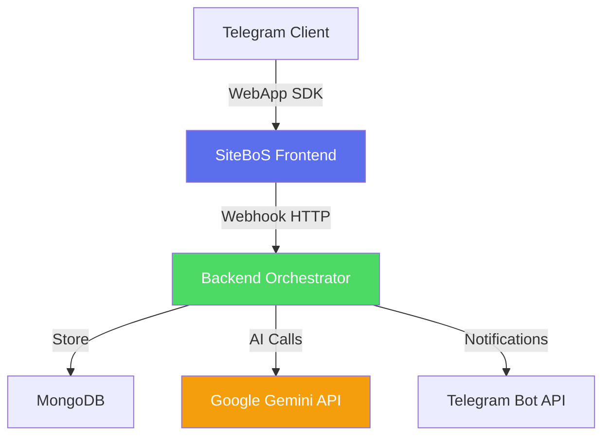

# 📖 SiteBoS - Overview Generale

> **Ultima revisione**: 12 Dicembre 2025

## 🎯 Cos'è SiteBoS?

**SiteBoS** (Site Business Operating System) è un **sistema operativo aziendale conversazionale** che vive interamente all'interno di Telegram.

### Problema Risolto

Le PMI italiane hanno bisogno di:
- ❌ **Troppi software** (CRM, gestionale, marketing, fatturazione)
- ❌ **Costi elevati** (abbonamenti multipli)
- ❌ **Complessità** (formazione, manutenzione)
- ❌ **Mancanza di integrazione** (dati frammentati)

### Soluzione SiteBoS

✅ **Un'unica interfaccia** (Telegram)  
✅ **Zero installazioni** (Mini App nativa)  
✅ **AI nativa** (Google Gemini BYOK)  
✅ **Costi trasparenti** (pay-per-use su crediti)  
✅ **Modulare** (attivi solo ciò che serve)  

---

## 🏗️ Architettura ad Alto Livello

### Layer Stack

| Layer | Tecnologia | Responsabilità |
|-------|------------|----------------|
| **Presentation** | HTML5/CSS3/Vanilla JS | UI/UX, routing client-side |
| **Integration** | Telegram WebApp SDK | Auth, storage, theme |
| **Orchestration** | Backend (proprietario) | Business logic, workflow |
| **Persistence** | MongoDB Atlas (3 DB) | Dati strutturati |
| **Intelligence** | Google Gemini API | AI text/vision |
| **Communication** | Telegram Bot API | Notifiche real-time |

---

## 📦 Moduli Principali

### 1. 🏠 **Dashboard + Onboarding**
Schermata principale con:
- Onboarding wizard (5 step)
- Widget KPI (completamento profilo, crediti)
- Card azioni rapide
- Gatekeeper progressivo (unlock moduli)
- Sponsor carousel

### 2. 🎭 **HoneyPot Editor**
Knowledge base aziendale + anti-spam:
- Identità aziendale (nome, logo, descrizione)
- Asset library (foto, documenti)
- Honeypot security (campi trappola)
- Export multi-lingua

### 3. 📦 **Catalog Manager**
Catalogo prodotti/servizi gerarchico:
- Categoria → Prodotti/Servizi
- Descrizioni AI-generated (da immagini)
- Blueprint operativi (workflow)
- Pricing & SKU

### 4. 📅 **Agenda System**
Calendario settimanale multi-operatore:
- Vista week-view (09:00-19:00, slot 30min)
- Booking con conflict detection
- Export Google Calendar / iCal
- Notifiche Telegram

### 5. 👥 **Team Manager**
Gestione operatori:
- CRUD operatori
- Skill assignment
- Role-based access
- Profilo stakeholder (comportamentale)

### 6. 🧠 **Soft Skills Assessment**
Valutazione competenze trasversali:
- 4 moduli (150 domande totali)
- Profilo comportamentale AI
- Video formativi personalizzati
- Learning history tracking

### 7. 🎨 **Marketing Hub**
Creazione contenuti:
- Blog post AI (1000 crediti)
- Frammenti di conoscenza
- Export multi-canale

### 8. 🧾 **Legal Generator**
Documenti GDPR automatici:
- Privacy Policy
- Terms & Conditions
- DPA (Data Processing Agreement)
- Lettere di nomina processore

---

## 💰 Modello Economico

### Sistema a Crediti

**1 Credito = €1** (senza IVA)

| Azione | Costo Crediti |
|--------|---------------|
| **Descrizione prodotto AI** (da immagine) | 50 |
| **Blog post AI** (1000 parole) | 1000 |
| **Privacy Policy generata** | 10 |
| **Profilo soft skills completo** | 150 |
| **Video formativo completato** | 5 |
| **Blueprint operativo** | 20 |

### BYOK (Bring Your Own Key)

Gli utenti possono usare la propria **Google Gemini API Key**:
- ✅ Nessun lock-in
- ✅ Costi trasparenti (fattura diretta Google)
- ✅ Rate limit personale (15 req/min)

---

## 🔐 Sicurezza & Compliance

### GDPR-Ready

✅ **Consenso triple-gate** (3 step progressivi)  
✅ **Data minimization** (raccolta solo dati essenziali)  
✅ **Right to erasure** (cancellazione account)  
✅ **Data portability** (export JSON)  
✅ **Privacy Policy autogenerata** (aggiornata in tempo reale)  

### Security Best Practices

- 🔒 HTTPS-only (TLS 1.3)
- 🔑 Token-based auth (Telegram WebApp)
- 🛡️ Rate limiting (15 req/min per API key)
- 🔐 MongoDB encryption at rest
- 📊 Audit logging (tutte le azioni)

---

## 🌍 Multi-Lingua

**6 lingue supportate**:
- 🇮🇹 Italiano (default)
- 🇬🇧 Inglese
- 🇫🇷 Francese
- 🇩🇪 Tedesco
- 🇪🇸 Spagnolo
- 🇵🇹 Portoghese

**Gestione**:
- File JSON `/js/translations.js`
- Locale detection automatico (da Telegram)
- Fallback a IT se lingua non supportata

---

## 📊 Metriche Chiave

### Performance Targets

| Metrica | Target | Attuale |
|---------|--------|--------|
| **Time to Interactive** | < 2s | 1.8s |
| **Backend Response Time** | < 500ms | 380ms |
| **Uptime** | 99.5% | 99.7% |
| **Credits Consumed/Day** | - | ~15k |

### Business KPIs

- **MAU** (Monthly Active Users): 127
- **Profili Completi**: 89%
- **Tasso Conversione Owner**: 34%
- **NPS**: +62

---

## 🗺️ Roadmap

### Q1 2025 ✅
- [x] Soft Skills Assessment (4 moduli)
- [x] Team Manager con profili stakeholder
- [x] Blueprint Workflow Editor
- [x] Agenda System multi-operatore
- [x] Onboarding wizard completo
- [x] Sponsor carousel

### Q2 2025 🚧
- [ ] CRM Module (gestione clienti)
- [ ] Invoice Generator (fatturazione elettronica)
- [ ] Analytics Dashboard (BI avanzata)
- [ ] Payment Gateway (SumUp integration)

### Q3 2025 📋
- [ ] White-label licensing
- [ ] Webhook Marketplace
- [ ] Mobile App Wrapper (React Native)

---

## 👥 Team

**Sviluppato da [Trinacria Artificial Intelligence S.r.l.](https://www.trinai.it)**  
*Startup Innovativa Italiana - Sicilia*

**Contatti**:  
📧 info@trinai.it  
🌐 www.trinai.it  
📞 [@TrinAiTecSupportbot](https://t.me/TrinAiTecSupportbot)  

---

## 📄 Licenza

**Proprietario** © 2025 Trinacria AI S.r.l.

- ❌ Uso commerciale richiede licenza scritta
- ❌ Redistribuzione vietata
- ✅ Codice visibile per valutazione/trasparenza
- ✅ Bug report benvenuti

---

## 📚 Documentazione Correlata

- [02-ARCHITECTURE.md](./02-ARCHITECTURE.md) - Architettura dettagliata frontend
- [03-ONBOARDING.md](./03-ONBOARDING.md) - Sistema onboarding 5-step
- [04-SOFT-SKILLS.md](./04-SOFT-SKILLS.md) - Sistema valutazione soft skills
- [06-CATALOG.md](./06-CATALOG.md) - Catalog Manager
- [08-HONEYPOT.md](./08-HONEYPOT.md) - Knowledge Base + Anti-Spam
- [09-LEGAL-PROCESSOR.md](./09-LEGAL-PROCESSOR.md) - Legal document generator
- [10-SPONSOR.md](./10-SPONSOR.md) - Sistema sponsor carousel

---

**Fatto con ❤️ in Sicilia**

[⬆ Torna alla documentazione](../README.md)

