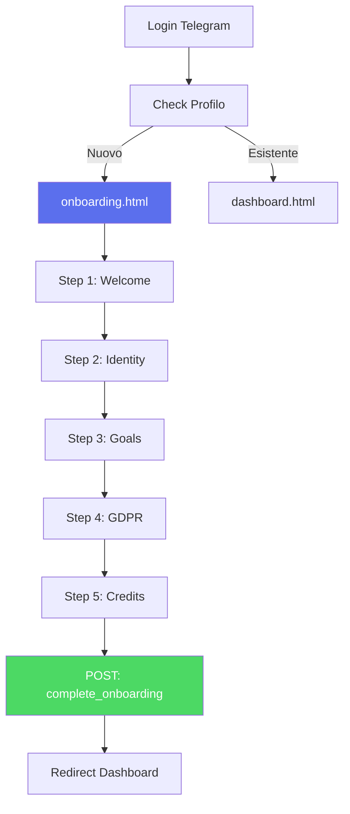

# 🚀 Onboarding System - Welcome Flow

> **Ultima revisione**: 12 Dicembre 2025  
> **Modulo**: `onboarding/`  
> **File**: `onboarding.html`  
> **Status**: Production ✅

---

## 🎯 Obiettivo

L'**Onboarding System** guida i nuovi utenti attraverso un **wizard interattivo 5-step** per completare il profilo aziendale e sbloccare i moduli SiteBoS.

---

## 📊 5 Step Flow

### Step 1: Benvenuto
- Introduzione a SiteBoS
- Video demo (30 secondi)
- CTA: "Inizia il Setup"

### Step 2: Identità Aziendale
- Nome azienda
- P.IVA
- Settore
- Numero dipendenti
- Logo upload (opzionale)

### Step 3: Obiettivi Business
- Selezione obiettivi (checkbox multiple):
  - Automatizzare processi
  - Migliorare comunicazione team
  - Gestire clienti CRM
  - Creare contenuti marketing
  - Altro (custom)
- Priorità (ranking 1-5)

### Step 4: Consensi GDPR
**Triple-Gate Consent**:
1. ✅ Accetto Privacy Policy
2. ✅ Consenso trattamento dati per servizio
3. ✅ Consenso comunicazioni marketing (opzionale)

### Step 5: Configurazione Crediti
**Scelta piano**:
- **Free Trial**: 100 crediti omaggio
- **Starter**: 500 crediti
- **Professional**: 2000 crediti
- **BYOK**: Usa la tua Gemini API Key

---

## 🔄 User Flow



---

## 🎨 Design Pattern

### Progress Bar
```html
<div class="progress-bar">
  <div class="progress-step active">1</div>
  <div class="progress-step">2</div>
  <div class="progress-step">3</div>
  <div class="progress-step">4</div>
  <div class="progress-step">5</div>
</div>
```

### Step Navigation
- **Bottoni**: "Indietro" | "Avanti" | "Completa"
- **Validazione**: Real-time per ogni campo
- **Autosave**: Ogni step salvato in sessionStorage

---

## 📊 Metriche Trackers

- **Completion Rate**: % utenti che finiscono l'onboarding
- **Drop-off Step**: Dove abbandonano
- **Avg Time per Step**: Tempo medio di compilazione
- **Skip Rate**: % utenti che saltano logo upload

---

## 📚 Documentazione Correlata

- [01-OVERVIEW.md](./01-OVERVIEW.md)
- [10-SPONSOR.md](./10-SPONSOR.md)

---

<div align="center">

**Onboarding System by [TrinAI](https://www.trinai.it)**

[⬆ Torna alla documentazione](../README.md)

</div>