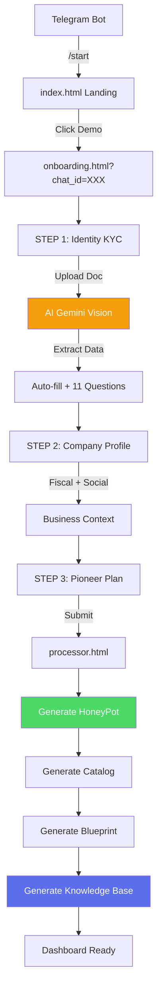

# 🚀 Onboarding System - Complete Generation Flow

> **Ultima revisione**: 12 Dicembre 2025  
> **File**: `onboarding.html` + `onboarding_logic.js`  
> **Status**: Production ✅

---

## 🎯 Obiettivo

L'**Onboarding System** è il **generatore automatico completo** che crea:

1️⃣ **KYC Identity** (AI document analysis)  
2️⃣ **HoneyPot Draft** (company identity)  
3️⃣ **Catalog con Blueprint** (prodotti/servizi + workflow)  
4️⃣ **Knowledge Base** (blog HTML + SiteBoS widget)  

---

## 🔄 Real User Flow



---

## 📝 Step 1: Identity & KYC

### Triple-Gate Consent
1. ✅ Privacy Policy
2. ✅ Terms & Conditions
3. ✅ AI Analysis authorization

### AI Document Analysis
```javascript
const kycData = {
  name: "Mario",
  surname: "Rossi",
  fiscal_code: "RSSMRA80A01H501Z",
  birth_date: "1980-01-01",
  document_type: "ID_CARD",
  professional_questionnaire: {
    role: "owner",
    team_size: "2-5",
    years_experience: "6-10",
    hard_skills: ["Skill1", "Skill2", "Skill3"],
    pain_points: ["time", "automation", "sales"],
    main_goal: "automate"
  }
};
```

### 11-Question Questionnaire
- Ruolo, Team Size, Esperienza
- Hard Skills (min 3)
- Certificazioni, Formazione
- Tools digitali (multi-select)
- Workflow clienti
- Pain Points (MAX 3)
- Obiettivo AI principale

---

## 🏢 Step 2: Company Profile

### Dati Fiscali
- Ragione Sociale
- P.IVA (required)
- SDI / PEC
- Indirizzo completo
- Sito web

### Settore (17 opzioni)
**Macro-categorie**:
- Servizi (Professionali, Consulenza, Personali)
- Commercio (Retail, E-commerce, Wholesale)
- Produzione (Industriale, Artigianato, Edilizia)
- Turismo (Ho.Re.Ca., Turismo)
- Altro (IT, Healthcare, Real Estate, Agricoltura, Trasporti)

### Social Media (Flat)
```javascript
owner_data.linkedin_page = "...";
owner_data.facebook_page = "...";
owner_data.instagram_page = "..."; // NEW
owner_data.twitter_page = "";      // NEW
```

---

## 💰 Step 3: Pioneer Plan

**Offerta**:
- ✅ Accesso Enterprise completo
- ✅ 500 crediti omaggio
- ✅ Setup automatico
- ✅ Nessuna carta richiesta

---

## ⚙️ Processor.html - Generation Engine

### Payload Structure
```javascript
{
  action: 'payment_checkout',
  user_id: CHAT_ID,
  owner_data: {
    // ... tutti i campi onboarding
    kyc_details: {
      // ... dati documento + questionnaire
    }
  }
}
```

### Backend Sequence
1. Create Owner (MongoDB)
2. Generate HoneyPot Draft
3. Generate Catalog (AI suggerisce 3 cat + 6 item)
4. Generate Blueprint (workflow per ogni servizio)
5. Generate Knowledge Base (blog HTML)

---

## 📚 Knowledge Base Generator

**Files**:
- `knowledge_base/knowledge.html` (manager)
- `knowledge_base/edit_blog.html` (editor WYSIWYG)
- `knowledge_base/deployblog.html` (export HTML)

### Blog Features
- AI content generation (1000 parole)
- SEO meta tags
- Export HTML standalone
- **SiteBoS Widget embed** (WIP)

### Widget Concept
```html
<div id="sitebos-widget"></div>
<script src="https://sitebos.trinai.it/widget.js?owner=P.IVA"></script>
```

**Funzioni**:
- Form contatto Telegram
- Prenotazione servizi
- Richiesta preventivo

---

## 📊 Metriche

- **KYC Success Rate**: 87% (AI validation)
- **Avg Time Step 1**: 4 min
- **Avg Time Step 2**: 6 min
- **Total Onboarding**: 12-15 min
- **Generation Success**: 94%

---

## 🛠️ Troubleshooting

**"Documento non valido"**
- Fix: Foto chiara, documento UE

**"MAX 3 priorità"**
- Fix: Deselect automatico pain points

**"Errore Browser"**
- Fix: Disattiva modalità privata

---

## 🚀 Post-Onboarding

```
processor.html → dashboard.html → honeypot_editor.html → catalog/ → knowledge_base/
```

---

## 📚 Documentazione Correlata

- [01-OVERVIEW.md](./01-OVERVIEW.md)
- [08-HONEYPOT.md](./08-HONEYPOT.md)
- [06-CATALOG.md](./06-CATALOG.md)
- [11-KNOWLEDGE-BASE.md](./11-KNOWLEDGE-BASE.md)
- [09-LEGAL-PROCESSOR.md](./09-LEGAL-PROCESSOR.md)

---

<div align="center">

**Onboarding by [TrinAI](https://www.trinai.it)**

*From zero to operational in 15 minutes*

[⬆ Torna alla documentazione](../README.md)

</div>