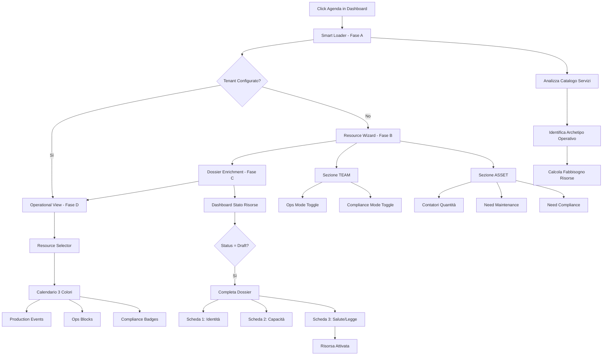

# 07 - AGENDA: Smart Resource Orchestrator

> **Ultima revisione**: 20 Dicembre 2025  
> **Path**: `/agenda`  
> **Status**: Production ✅

---

## 🎯 Obiettivo

Il modulo **Agenda** non è un semplice calendario visivo. È un **gestore di disponibilità a livelli** che orchestr a risorse umane e asset fisici attraverso tre layer temporali:

1. **Production Layer** (💰): Appuntamenti e Vendite (Fatturato)
2. **Ops Layer** (🔧): Fermi tecnici, Turni, Ferie, Pulizie (Vincoli Rigidi)
3. **Compliance Layer** (📅): Scadenze legali, Audit, Certificazioni (Task Generativi)

L'utente **dichiara le risorse**, il sistema (tramite AI/Webhook) costruisce l'infrastruttura temporale su **Google Calendar** (Strategia Satellite).

---

## 📊 Architettura

### User Journey Completo



### I 4 Fasi Dettagliate

#### **FASE A: Smart Entry & AI Architect**

**Scopo**: Decisione intelligente su dove atterrare.

**File**: `index.html`, `orchestrator_logic.js`

**Flow**:
1. Loader intelligente con feedback di stato
2. Chiamata webhook: `analyze_tenant` con VAT
3. Analisi:
   - Servizi venduti nel catalogo
   - Operatori già censiti
   - Stato configurazione risorse
4. **Decision Fork**:
   - Se `is_configured = true` → GOTO Fase D (Operational)
   - Se `is_configured = false` → GOTO Fase B (Wizard)

**Webhook Payload**:
```json
{
  "action": "analyze_tenant",
  "vat": "IT12345678901",
  "timestamp": "2025-12-20T10:30:00Z"
}
```

**Expected Response**:
```json
{
  "is_configured": false,
  "resources_ready": false,
  "archetype": "service_business",
  "resource_requirements": {
    "services_count": 12,
    "operators_count": 3
  },
  "existing_operators": [
    { "id": "op_123", "name": "Mario Rossi", "role": "Tecnico" }
  ],
  "asset_suggestions": [
    {
      "id": "asset_lift",
      "name": "Ponti Sollevatori",
      "icon": "fas fa-car-lift",
      "ai_reason": "Hai servizi di Tagliando",
      "default_maintenance": true,
      "default_compliance": true
    }
  ]
}
```

---

#### **FASE B: Resource Wizard (L'Intervista)**

**Scopo**: Configurare HUMAN e ASSET senza "foglio bianco".

**File**: `wizard.html`, `wizard_logic.js`

**UI Structure**:

**1. Sezione TEAM (Human Resources)**
- Lista operatori esistenti con avatar
- **Toggles per ogni operatore**:
  - 🔘 **Ops Mode**: Abilita Turni/Ferie (blocca agenda se assente)
  - 🔘 **Compliance Mode**: Abilita scadenze (Patenti, Visite mediche)
- Bottone `[+]` per aggiungere collaboratori al volo

**2. Sezione ASSET (Physical Resources)**
- **Suggerimenti AI**: Basati sui servizi (es. "Hai 'Tagliando' → Ti servono 'Ponti Sollevatori'")
- **Contatori Quantità**: `[-]` `[0]` `[+]` per ogni categoria
- **Layer Toggles** (appaiono se qty > 0):
  - 🔘 **Need Maintenance** (default ON per macchinari)
  - 🔘 **Need Compliance** (default ON per asset regolamentati)
- Bottone per asset custom

**3. Azione Finale**
- **`[GENERA INFRASTRUTTURA]`**
- Crea "Ghost Assets" (bozze)
- Predispone calendari Google

**Webhook Call**: `generate_infrastructure`

**Payload**:
```json
{
  "action": "generate_infrastructure",
  "vat": "IT12345678901",
  "configuration": {
    "operators": [
      {
        "id": "op_123",
        "name": "Mario Rossi",
        "ops_enabled": true,
        "compliance_enabled": false
      }
    ],
    "assets": [
      {
        "id": "asset_lift",
        "name": "Ponti Sollevatori",
        "quantity": 3,
        "maintenance_enabled": true,
        "compliance_enabled": true
      }
    ]
  }
}
```

**Expected Response**:
```json
{
  "status": "success",
  "resources": [
    {
      "id": "res_001",
      "name": "Ponte Sollevatore #1",
      "type": "asset",
      "category": "lift",
      "status": "draft",
      "layers": {
        "production": true,
        "ops": true,
        "compliance": true
      }
    }
  ],
  "google_calendars_prepared": true
}
```

---

#### **FASE C: Dossier Enrichment (Il Triage)**

**Scopo**: Dare identità alle risorse Ghost (Draft → Ready).

**File**: `dossier.html`, `dossier_logic.js`

**Dashboard di Stato**:
- **Card per ogni risorsa** con indicatori:
  - 🟡 **Draft** (Giallo): Dati mancanti
  - 🟢 **Ready** (Verde): Completo
  - 🔴 **Error** (Rosso): Google Auth mancante

**Modal Dossier (3 Tab)**:

**Tab 1: Identità (Anagrafica)**
```
- Nome specifico* (es. "Ponte Nord")
- Marca
- Modello
- Serial Number/Matricola
- Data Installazione
```

**Tab 2: Capacità (Production)**
```
- Slot simultanei* (es. Sala=8 posti, Ponte=1 auto)
- Orari apertura specifici (textarea)
- Note capacità
```

**Tab 3: Salute & Legge (Ops/Compliance)**
```
--- Routine Manutenzione ---
- Cosa fare? (es. "Pulizia Filtri")
- Frequenza (daily/weekly/monthly)
- Durata (minuti)

--- Scadenze Legali ---
- Tipo scadenza (es. "Revisione INAIL")
- Data scadenza
```

**Al Salvataggio**:
1. Risorsa diventa 🟢 **Verde**
2. Calendari Google creati e sincronizzati
3. Layer temporali attivi

**Webhook Call**: `complete_dossier`

**Payload**:
```json
{
  "action": "complete_dossier",
  "vat": "IT12345678901",
  "dossier": {
    "resource_id": "res_001",
    "identity": {
      "specific_name": "Ponte Nord",
      "brand": "Ravaglioli",
      "model": "KPN324",
      "serial": "AB123456",
      "install_date": "2020-03-15"
    },
    "capacity": {
      "slots": 1,
      "specific_hours": "Lun-Ven 08:00-18:00",
      "notes": "Solo auto fino a 2.5 ton"
    },
    "health": {
      "routine_task": "Lubrificazione catene",
      "routine_freq": "monthly",
      "routine_duration": 45,
      "deadline_type": "Revisione INAIL",
      "deadline_date": "2025-10-12"
    }
  }
}
```

---

#### **FASE D: Operational View (Il Cockpit)**

**Scopo**: Utilizzo quotidiano - Vista calendario operativa.

**File**: `calendar.html` (da creare - vedi roadmap)

**Header di Navigazione**:
- **Resource Selector** (dropdown): `[Mio Calendario]`, `[Calendario Mario]`, `[Ponte 1]`
- **Status Indicators**: 🔧 Manutenzione oggi, ⚠️ Scadenza vicina
- **Asset Edit (⚙️)**: Link rapido al Dossier

**Il Calendario Visivo (3 Colori)**:

1. **🟦 Eventi Blu/Verdi (Production)**
   - Appuntamenti clienti
   - Vendite/commesse
   - Click → Dettaglio commessa

2. **⬜ Blocchi Grigi/Striati (Ops/Maintenance)**
   - Fermi rigidi generati dal sistema
   - Es: "Ferie Mario", "Pulizia Ponte"
   - **Non spostabili** se non cambiando la regola
   - L'utente vede visivamente perché non può prenotare

3. **🔔 Badge/Task (Compliance)**
   - **Non bloccano slot**
   - Appaiono come "Promemoria Giornaliero" in alto
   - Es: "⚠️ Scadenza Revisione tra 7 giorni"

**Integrazione Google Calendar**:
- Ogni risorsa = 1 calendario Google dedicato
- Sync bidirezionale (eventi creati in Google appaiono qui)
- Export iCal disponibile

---

## 🔧 Implementazione

### File Structure

```
/agenda
  ├── index.html            # Entry point - Smart Loader
  ├── orchestrator_logic.js # Core logic & webhook calls
  ├── wizard.html           # Fase B - Resource Wizard
  ├── wizard_logic.js       # Wizard controller
  ├── dossier.html          # Fase C - Enrichment Dashboard
  ├── dossier_logic.js      # Dossier controller
  ├── calendar.html         # Fase D - Operational View (TODO)
  ├── calendar_logic.js     # Calendar controller (TODO)
  └── -*.html               # File legacy (da sostituire)
```

### Webhook Endpoint

**Base URL**: `https://trinai.api.workflow.dcmake.it/webhook/8f148592-cbb9-4c72-96e8-73c08fccee43`

**Protocollo**: POST JSON

**Actions Disponibili**:

| Action | Fase | Scopo |
|--------|------|-------|
| `analyze_tenant` | A | Analizza setup esistente |
| `generate_infrastructure` | B | Crea risorse Ghost |
| `get_draft_resources` | C | Recupera risorse da completare |
| `complete_dossier` | C | Attiva risorsa con dati completi |
| `activate_all_resources` | C | Attivazione batch |
| `get_calendar_events` | D | Fetch eventi (Production/Ops/Compliance) |
| `create_booking` | D | Nuovo appuntamento |
| `update_ops_rule` | D | Modifica regola manutenzione |

**Common Request Structure**:
```json
{
  "action": "<action_name>",
  "vat": "IT12345678901",
  "timestamp": "2025-12-20T10:30:00Z",
  ...<action-specific-data>
}
```

**Common Response Structure**:
```json
{
  "status": "success" | "error",
  "message": "Human-readable message",
  "data": { ... },
  "errors": [ ... ] // se status = error
}
```

---

## 📊 Metriche

### KPIs Tracciati

1. **Setup Completion Rate**
   - % tenant che completano il wizard
   - Drop-off per fase (A/B/C/D)

2. **Resource Utilization**
   - Ore disponibili vs ore prenotate
   - Asset con utilizzo < 20% (alert inefficienza)

3. **Compliance Adherence**
   - Scadenze rispettate vs scadute
   - Tempo medio di anticipo revisioni

4. **Ops Efficiency**
   - Conflitti evitati (tentativi prenotazione su slot occupati)
   - Tempo risparmiato con automazioni

### Analytics Events

```javascript
// Tracciare con analytics esistente
analytics.track('agenda_wizard_started', { vat, archetype });
analytics.track('agenda_resource_added', { vat, resource_type, quantity });
analytics.track('agenda_dossier_completed', { vat, resource_id, time_spent });
analytics.track('agenda_booking_created', { vat, resource_id, layer: 'production' });
```

---

## 🛠️ Troubleshooting

### Errori Comuni

**1. "Google Calendar Auth Failed"**
- **Causa**: Token OAuth scaduto
- **Fix**: Forzare re-auth in dossier modal
- **Webhook Response**: `{ "error": "google_auth_required", "auth_url": "..." }`

**2. "Resource Already Exists"**
- **Causa**: Tentativo di creare risorsa duplicata
- **Fix**: Mostrare risorsa esistente, offrire modifica

**3. "Slot Conflict"**
- **Causa**: Tentativo booking su slot occupato (Ops Layer)
- **Fix**: Mostrare visivamente il blocco grigio con motivo

### Debug Mode

Abilitare debug info nel loader:
```javascript
// In orchestrator_logic.js
const DEBUG = true; // mostra payload/response webhook
```

---

## 🚀 Roadmap

### Q1 2026 🚧

- [ ] **Calendar View (Fase D)**: Vista operativa con FullCalendar.js
- [ ] **Google Calendar Sync**: Integrazione OAuth + bidirectional sync
- [ ] **Booking Flow**: Creazione appuntamenti da calendario
- [ ] **Conflict Detection**: Visual feedback per slot occupati

### Q2 2026 📋

- [ ] **AI Optimizer**: Suggerimenti riorganizzazione slot per efficienza
- [ ] **Multi-Resource Booking**: Prenota più risorse contemporaneamente
- [ ] **Recurring Events**: Eventi ricorrenti con eccezioni
- [ ] **Export/Import**: iCal, Outlook, CSV

### Q3 2026 🔮

- [ ] **Mobile App**: Notifiche push per scadenze
- [ ] **Team Collaboration**: Commenti su eventi, @mentions
- [ ] **Resource Analytics**: Dashboard KPI per risorsa
- [ ] **White-Label Calendar**: Calendar pubblico per clienti

---

## 📚 Documentazione Correlata

- [01-OVERVIEW.md](./01-OVERVIEW.md) - Architettura generale SiteBoS
- [05-TEAM-MANAGER.md](./05-TEAM-MANAGER.md) - Gestione operatori (integrato)
- [06-CATALOG.md](./06-CATALOG.md) - Servizi venduti (analizzati per asset)
- [SESSION_ARCHITECTURE.md](./SESSION_ARCHITECTURE.md) - Gestione sessione/VAT
- [WEBHOOK_FLOW.md](../WEBHOOK_FLOW.md) - Protocollo comunicazione backend

---

## ✅ Checklist Implementazione

### Fase A - Smart Entry
- [x] index.html con loader intelligente
- [x] orchestrator_logic.js con webhook integration
- [x] Decision fork logic (configured vs wizard)
- [x] Error overlay con fallback

### Fase B - Wizard
- [x] wizard.html con sezioni TEAM/ASSET
- [x] wizard_logic.js con contatori e toggles
- [x] AI suggestions rendering
- [x] Generate infrastructure webhook call

### Fase C - Dossier
- [x] dossier.html con dashboard stato
- [x] dossier_logic.js con modal 3-tab
- [x] Form validation
- [x] Complete dossier webhook call

### Fase D - Calendar (TODO)
- [ ] calendar.html con FullCalendar integration
- [ ] calendar_logic.js con 3-layer rendering
- [ ] Google Calendar sync
- [ ] Booking creation flow

---

## 🌟 Perché questa UX è "Agnostica & Vincente"

1. **Zero "Foglio Bianco"**: L'AI costruisce l'agenda, l'utente dice solo "Sì, ne ho 3" e "La matricola è XYZ"
2. **Protezione Attiva**: Il sistema impedisce errori umani (non puoi prenotare se la poltrona è in manutenzione)
3. **Scalabilità Infinita**: Funziona per 1 persona (Consulente) o 50 asset (Fabbrica), perché la logica "Resource + 3 Layers" è universale
4. **Google as Infra**: Usa Google Calendar come infrastruttura temporale (affidabile, scalabile, gratis)
5. **AI-Powered Setup**: Nessun manuale da leggere, l'AI deduce cosa serve dai servizi venduti

---

**Ultimo aggiornamento**: 20 Dicembre 2025  
**Responsabile**: Team Development SiteBoS  
**Status**: ✅ Fase A/B/C Complete | 🚧 Fase D in Roadmap