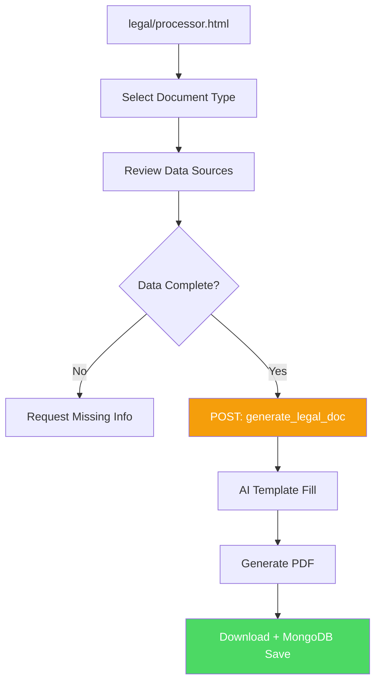

# 🧾 Legal Document Processor

> **Ultima revisione**: 12 Dicembre 2025  
> **Modulo**: `legal/`  
> **File**: `processor.html`  
> **Status**: Production ✅

---

## 🎯 Obiettivo

Il **Legal Processor** genera automaticamente documenti legali GDPR-compliant basati sui dati del profilo aziendale.

---

## 📝 Documenti Generati

### 1. Privacy Policy
- Identità titolare trattamento
- Finalità trattamento dati
- Base giuridica (GDPR Art. 6)
- Categorie dati raccolti
- Periodo conservazione
- Diritti interessati (Art. 15-22)
- Cookie policy

**Costo**: 10 crediti

### 2. Terms & Conditions
- Oggetto contratto
- Obblighi utente
- Limitazioni responsabilità
- Proprietà intellettuale
- Risoluzione controversie
- Foro competente

**Costo**: 10 crediti

### 3. DPA (Data Processing Agreement)
- Nomina responsabile trattamento
- Misure sicurezza (Art. 32)
- Sub-processori autorizzati
- Data breach notification
- Audit rights

**Costo**: 15 crediti

### 4. Lettera Nomina Processore
- Identificazione processore
- Ambito trattamento
- Istruzioni vincolanti
- Clausola riservatezza

**Costo**: 5 crediti

---

## 🔄 Generation Flow



---

## 🤖 AI Template Engine

### Data Sources
```javascript
const legalData = {
  company: honeypot.company_identity,
  contacts: owner.email, owner.phone,
  vat: owner.vat_number,
  address: owner.headquarters,
  services: catalog.categories,
  data_collected: [
    'Nome, Cognome',
    'Email',
    'Telefono',
    'IP Address',
    'Cookie tecnici'
  ],
  retention_period: '5 anni (obblighi fiscali)',
  dpo: owner.dpo_contact || 'Non nominato'
};
```

### Template Placeholder Replacement
```
{{COMPANY_NAME}} → TrinAI S.r.l.
{{VAT_NUMBER}} → IT07335120825
{{EMAIL}} → info@trinai.it
{{SERVICES_LIST}} → Consulenza AI, Formazione, Sviluppo Software
{{GDPR_DATE}} → 25 maggio 2018
{{CURRENT_DATE}} → 12 dicembre 2025
```

---

## 📊 Metriche

- **Docs Generated**: Privacy Policy (89%), T&C (67%), DPA (34%)
- **Avg Generation Time**: 4.2 secondi
- **User Edits**: 23% utenti modificano template post-generazione

---

## 🔐 Compliance

### GDPR Articoli Coperti
- **Art. 6**: Base giuridica trattamento
- **Art. 13-14**: Informativa
- **Art. 15-22**: Diritti interessati
- **Art. 28**: Responsabile trattamento
- **Art. 32**: Misure sicurezza
- **Art. 33-34**: Data breach notification

### Lingua Legale
Documenti disponibili in:
- 🇮🇹 Italiano (default)
- 🇬🇧 Inglese

---

## 🛠️ Troubleshooting

**1. "Dati mancanti"**
- **Causa**: Profilo honeypot incompleto
- **Fix**: Compilare identità aziendale

**2. "PDF non scarica"**
- **Causa**: Browser block popup
- **Fix**: Consentire popup da Telegram

---

## 📚 Documentazione Correlata

- [01-OVERVIEW.md](./01-OVERVIEW.md)
- [08-HONEYPOT.md](./08-HONEYPOT.md)

---

<div align="center">

**Legal Processor by [TrinAI](https://www.trinai.it)**

[⬆ Torna alla documentazione](../README.md)

</div>