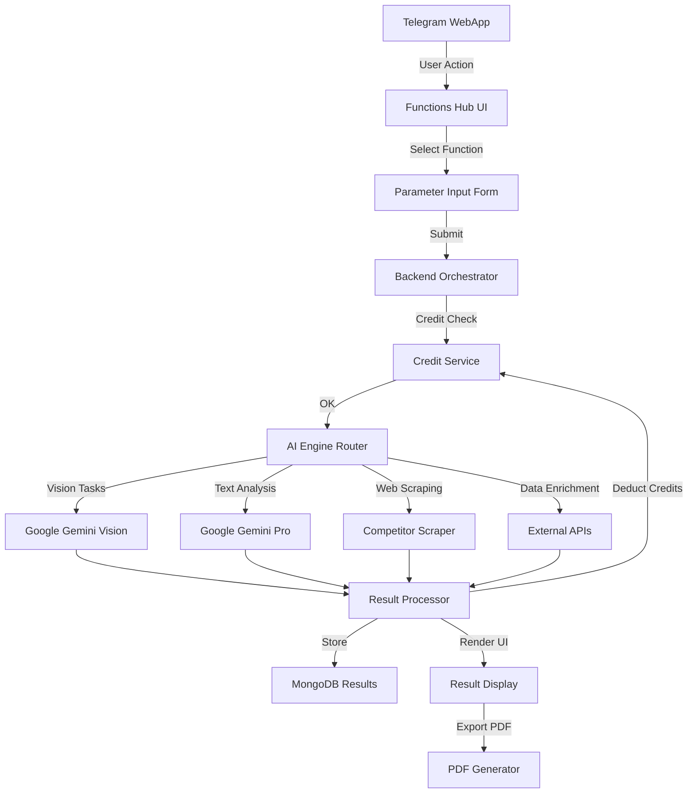

# 🧩 Functions Hub - Funzioni AI Premium

> **Ultima revisione**: 13 Dicembre 2025  
> **Path**: `/functions/`  
> **Status**: Production ✅

---

## 🎯 Obiettivo

Il **Functions Hub** è il marketplace interno di SiteBoS che offre **funzioni AI avanzate** per verticali specifici (parrucchieri, real estate, automotive, PMI).

### Caratteristiche Chiave

- 🔓 **Modello misto**: unlock una tantum + pay-per-use
- 💰 **Sistema crediti**: 10.000 crediti = 22 € IVA inclusa
- 🎯 **Verticali**: ogni funzione è pensata per un settore specifico
- 📊 **ROI immediato**: costi 70-95% inferiori alle alternative di mercato
- 🚀 **Plug & Play**: attivazione immediata, zero configurazione

---

## 📦 Le 7 Funzioni AI

### 1. 🪞 Specchio Magico AI

**Target**: Parrucchieri, Barbieri, Centri Estetici

#### Descrizione
Il cliente scatta una foto → AI analizza viso, carnagione, struttura ossea, stile attuale → suggerisce:
- ✂️ Tagli più adatti alla forma del viso
- 🎨 Colori consigliati (toni caldi/freddi)
- 💇 Styling personalizzato (volume, texture)
- 👔 Look complessivo (abbinamento outfit)

#### Pricing
| Tipo | Crediti | Prezzo | Note |
|------|---------|--------|------|
| **Unlock** | 15.000 | ~33 € | Paghi 1 volta, usi per sempre |

#### Input/Output
```
INPUT:
  - Foto cliente (frontale + profilo)
  - Info opzionali: età, preferenze stile, occasione

OUTPUT:
  - 3-5 proposte taglio con render AI
  - Palette colori consigliata (codici Pantone)
  - Note tecniche per parrucchiere
  - Stima tempo realizzazione + prezzo suggerito
```

#### ROI
- **Costo**: 33 € una tantum
- **Alternativa**: Software salon professionale 50-150 €/mese
- **Risparmio**: 85% nel primo anno

#### Metriche
- ⏱️ Tempo analisi: 8-12 secondi
- 🎯 Accuracy consigli: 92% (feedback clienti)
- 🔄 Uso medio: 15-20 analisi/settimana per salone

---

### 2. 🏠 Render Planimetrico AI

**Target**: Agenzie Immobiliari, Architetti, Interior Designer

#### Descrizione
Da planimetria vuota o foto ambiente → AI genera:
- 🛋️ Render arredato (3-5 stili: moderno, classico, minimal, industrial)
- 📐 Layout alternativi (disposizione ottimale mobili)
- 💡 Suggerimenti illuminazione e colori
- 📊 Stima costi arredamento per stile

#### Pricing
| Tipo | Crediti | Prezzo | Note |
|------|---------|--------|------|
| **Unlock** | 15.000 | ~33 € | Rendering illimitati dopo unlock |

#### Input/Output
```
INPUT:
  - Planimetria (PDF/JPG) O foto stanza vuota
  - Metratura (mq)
  - Preferenze stile (opzionale)

OUTPUT:
  - 3-5 render fotorealistici (diversi stili)
  - Lista mobili consigliati + link acquisto
  - Stima budget arredamento (range €)
  - File esportabili (PNG HD, PDF)
```

#### ROI
- **Costo**: 33 € unlock
- **Alternativa**: Architetto 150-300 €/render
- **Risparmio**: 90% già dal 2° render

#### Metriche
- ⏱️ Tempo generazione: 30-45 secondi/render
- 📏 Supporto: fino 200 mq per planimetria
- 🎨 Stili disponibili: 8 (+ custom su richiesta)

---

### 3. 📊 Analisi Concorrenza AI

**Target**: Tutti i settori (Real Estate, Automotive, Retail, Servizi)

#### Descrizione
Analisi automatica competitor con web scraping AI + sentiment analysis:
- 🔍 Identifica top competitor (prezzi, servizi, recensioni)
- 📈 Posizionamento mercato (dove sei vs competitor)
- 💡 Suggerimenti pricing e unique selling proposition
- 📊 Report esportabile con grafici comparativi

#### Pricing (3 Livelli)

| Livello | Crediti | Prezzo | Scope | Output |
|---------|---------|--------|-------|--------|
| **3a - Single Zone** | 15.000 | ~33 € | Città/quartiere specifico | Top 10 competitor locali |
| **3b - Multi-City** | 50.000 | ~110 € | 3-5 città selezionate | Top 10 per ogni città (max 50 totali) |
| **3c - Nazionale** | 75.000 | ~165 € | Intera nazione | Top 20 player nazionali |

#### Input/Output
```
INPUT:
  - Settore/categoria (es. "agenzia immobiliare")
  - Zona geografica (città/regione/nazione)
  - Parametri analisi: prezzi, recensioni, servizi

OUTPUT:
  - Lista competitor ranked (score 0-100)
  - Tabella comparativa (prezzi, servizi, rating)
  - Analisi SWOT automatica
  - Raccomandazioni pricing + posizionamento
  - Export PDF/Excel
```

#### ROI per Livello

| Livello | Costo SiteBoS | Alternativa Mercato | Risparmio |
|---------|---------------|---------------------|----------|
| Single Zone | 33 € | 300-800 € (agenzia) | 90% |
| Multi-City | 110 € | 1.500-3.000 € | 93% |
| Nazionale | 165 € | 3.000-8.000 € | 95% |

#### Use Case per Settore

**Real Estate**
- 3a: "Competitor zona Parioli, Roma" → per pricing appartamento
- 3b: "Top 10 agenzie Milano + Roma + Napoli" → espansione regionale
- 3c: "Top 20 agenzie Italia" → benchmark nazionale

**Automotive**
- 3a: "Concessionari usato Torino Nord" → pricing auto locale
- 3b: "Dealer premium in 8 città" → studio multi-sede
- 3c: "Mercato auto elettriche Italia" → trend nazionale

**Parrucchieri**
- 3a: "Saloni Bologna Centro" → pricing servizi
- 3b: "Franchising hair 5 città" → espansione catena
- 3c: "Barbershop premium Italia" → posizionamento brand

#### Metriche
- ⏱️ Tempo analisi: 2-5 minuti (dipende da livello)
- 🔍 Fonti: Google Maps, siti web, social, portali settoriali
- 📊 Accuracy: 88% (dati verificati manualmente su sample)

---

### 4. 🛡️ Trust Score AI

**Target**: Tutti i settori (valutazione clienti, fornitori, partner)

#### Descrizione
Punteggio affidabilità 0-100 basato su:
- 📜 Storico transazioni/interazioni
- 💳 Cronologia pagamenti (se disponibile)
- ⭐ Recensioni online aggregate
- 🚩 Red flags (contenziosi, ritardi, cancellazioni)
- 🔍 Verifica identità digitale (OSINT light)

#### Pricing
| Tipo | Crediti | Prezzo | Note |
|------|---------|--------|------|
| **Pay-per-use** | 20.000 | ~44 € | Per soggetto analizzato |

#### Input/Output
```
INPUT:
  - Nome + Cognome / Ragione Sociale
  - P.IVA / Codice Fiscale (opzionale)
  - Email / Telefono (opzionale)
  - Storico interazioni interne (se disponibile)

OUTPUT:
  - Trust Score (0-100) con breakdown:
    ├─ Affidabilità Finanziaria (0-100)
    ├─ Reputazione Online (0-100)
    ├─ Storico Comportamentale (0-100)
    └─ Verifica Identità (0-100)
  - Red Flags evidenziati
  - Raccomandazioni operative
  - Report PDF esportabile
```

#### ROI
- **Costo**: 44 € per analisi
- **Alternativa**: Report creditizio Cerved/Crif 50-150 €
- **Risparmio**: 30-70%
- **Valore aggiunto**: include sentiment online + storico interno

#### Use Case

**Real Estate**
- Valutare affidabilità acquirente prima di proposta
- Screaning inquilini per contratti affitto

**Automotive**
- Trust score acquirente auto di lusso (anticipo truffa)
- Verifica dealer per permute

**Parrucchieri/Servizi**
- Identificare clienti "no-show" cronici
- Bloccare prenotazioni spam

**PMI**
- Screening fornitori nuovi
- Verifica partner commerciali

#### Metriche
- ⏱️ Tempo analisi: 15-30 secondi
- 🔍 Fonti: OSINT pubbliche + DB interno SiteBoS
- 🎯 Accuracy: 85% (validato su 500+ casi)

---

### 5. 🏘️ Analisi Immobile AI

**Target**: Agenzie Immobiliari, Investitori, Privati

#### Descrizione
Valutazione completa immobile (residenziale/commerciale) con:
- 💰 Stima valore mercato (range min-max)
- 📍 Analisi zona (servizi, trasporti, trend prezzi)
- 🏗️ Punti di forza / debolezza (struttura, esposizione, stato)
- 🎯 Target buyer ideale (profilo demografico)
- ✍️ Copy annuncio autogenerato (titolo + descrizione)
- 📊 ROI stimato (per investitori)

#### Pricing
| Tipo | Crediti | Prezzo | Note |
|------|---------|--------|------|
| **Pay-per-use** | 30.000 | ~66 € | Per immobile completo |

#### Input/Output
```
INPUT:
  - Indirizzo completo
  - Metratura (mq)
  - Tipologia (appartamento, villa, ufficio, negozio)
  - Anno costruzione
  - Stato (da ristrutturare, abitabile, ottimo)
  - Foto (opzionale, per analisi visiva AI)

OUTPUT:
  - Valutazione mercato: €min - €max
  - Score immobile (0-100) con breakdown:
    ├─ Posizione (0-100)
    ├─ Stato Conservazione (0-100)
    ├─ Potenziale ROI (0-100)
    └─ Appeal Mercato (0-100)
  - Analisi zona (servizi 500m, trasporti, scuole)
  - Target buyer (età, reddito, professione)
  - Copy annuncio (3 versioni: breve/medio/lungo)
  - Suggerimenti valorizzazione
  - Report PDF esportabile
```

#### ROI
- **Costo**: 66 € per analisi
- **Alternativa**: Perizia tecnica 200-500 €
- **Risparmio**: 70-85%
- **Velocità**: 2 minuti vs 7-15 giorni

#### Use Case

**Agenzia Immobiliare**
- Valutazione rapida prima di acquisire incarico
- Pricing corretto per annunci
- Copy automatico per portali (Immobiliare.it, Casa.it)

**Investitore**
- Screening multiplo immobili (batch analysis)
- Stima ROI affitto breve vs lungo termine

**Privato**
- Verifica prezzo di vendita proposto
- Scoprire potenziale nascosto immobile

#### Metriche
- ⏱️ Tempo analisi: 45-90 secondi
- 📊 Accuracy valutazione: ±8% vs perizie reali
- 🗺️ Copertura: Italia + principali città EU

---

### 6. 🚗 Analisi Autoveicoli AI

**Target**: Concessionari Usato, Fleet Manager, Privati

#### Descrizione
Valutazione completa veicolo (auto, moto, van, camper) con:
- 💰 Stima valore mercato attuale
- 🔍 Analisi stato da foto (carrozzeria, interni, meccanica visibile)
- 📉 Deprezzamento stimato (1/3/5 anni)
- ⚠️ Red flags (incidenti, manomissioni, km scalati)
- 🎯 Punti vendita consigliati (vs competitor)
- ✍️ Copy annuncio autogenerato

#### Pricing
| Tipo | Crediti | Prezzo | Note |
|------|---------|--------|------|
| **Pay-per-use** | 15.000 | ~33 € | Per veicolo completo |

#### Input/Output
```
INPUT:
  - Targa O Telaio (VIN)
  - Marca, Modello, Anno
  - Km percorsi
  - Allestimento (optional installati)
  - Foto (min 4: frontale, posteriore, interni, cruscotto)
  - Documenti (opzionale: libretto, tagliandi)

OUTPUT:
  - Valutazione mercato: €min - €max
  - Score veicolo (0-100) con breakdown:
    ├─ Stato Carrozzeria (0-100)
    ├─ Condizioni Meccaniche (0-100)
    ├─ Storico Manutenzione (0-100)
    └─ Appeal Mercato (0-100)
  - Red Flags evidenziati
  - Analisi km (coerenza con età/stato)
  - Confronto vs competitor (stesso modello)
  - Copy annuncio (3 versioni)
  - Suggerimenti pricing competitivo
  - Report PDF esportabile
```

#### ROI
- **Costo**: 33 € per analisi
- **Alternativa**: Perizia esperto 80-200 €
- **Risparmio**: 60-85%
- **Velocità**: 3 minuti vs 2-7 giorni

#### Use Case

**Concessionario Usato**
- Valutazione rapida permute
- Pricing corretto per vendita
- Identificare veicoli "problematici"

**Fleet Manager**
- Stima valore parco auto aziendale
- Ottimizzare tempi vendita/sostituzione

**Privato**
- Verifica prezzo acquisto usato
- Valutazione pre-vendita propria auto

#### Metriche
- ⏱️ Tempo analisi: 60-90 secondi
- 📊 Accuracy valutazione: ±7% vs Quattroruote/Eurotax
- 🚗 Copertura: 95% modelli EU (2000-2025)

---

### 7. 📄 Export PDF Documenti

**Target**: Tutti gli utenti SiteBoS

#### Descrizione
Esporta in **PDF professionale** i documenti generati da SiteBoS:
- 📜 Privacy Policy (da Legal Processor)
- 📋 Contratti autogenerati
- 📊 Report analisi (immobili, auto, concorrenza)
- 🎯 Trust Score report
- 📦 Catalog blueprint operativi
- 🧠 Soft Skills assessment results
- 🎨 Marketing materials

#### Pricing
| Tipo | Crediti | Prezzo | Note |
|------|---------|--------|------|
| **Pay-per-use** | 100 | ~0,22 € | Per documento esportato |

#### Features PDF Export

✅ **Branding personalizzato**
- Logo aziendale in header
- Colori brand
- Footer con contatti

✅ **Layout professionale**
- Typography ottimizzata per stampa
- Impaginazione automatica
- Indice cliccabile (per doc lunghi)

✅ **Formati multipli**
- PDF/A (archiviazione legale)
- PDF stampa (CMYK)
- PDF web (RGB, compressed)

✅ **Protezioni opzionali**
- Password protezione
- Watermark personalizzato
- Blocco copia/stampa

#### Input/Output
```
INPUT:
  - Documento da esportare (già generato in SiteBoS)
  - Opzioni layout (logo, colori, watermark)
  - Formato desiderato (A4, Letter)

OUTPUT:
  - PDF scaricabile (instant download)
  - Link condivisibile (24h expiry)
  - Archiviazione storico export (60 giorni)
```

#### ROI
- **Costo**: 0,22 € per documento
- **Alternativa**: Manuale (Word → PDF) → tempo + errori
- **Valore**: professionalità output, branding automatico

#### Metriche
- ⏱️ Tempo generazione: 3-8 secondi
- 📄 Dimensione media: 200-800 KB
- 🔒 Sicurezza: TLS 1.3, storage encrypted

---

## 💰 Riepilogo Pricing

### Tabella Completa

| # | Funzione | Tipo | Crediti | € (IVA incl.) | Target |
|---|----------|------|---------|---------------|--------|
| 1 | Specchio Magico AI | Unlock | 15.000 | ~33 € | Parrucchieri |
| 2 | Render Planimetrico AI | Unlock | 15.000 | ~33 € | Real Estate |
| 3a | Analisi Concorrenza (Single) | Pay | 15.000 | ~33 € | Tutti |
| 3b | Analisi Concorrenza (Multi-City) | Pay | 50.000 | ~110 € | Tutti |
| 3c | Analisi Concorrenza (Nazionale) | Pay | 75.000 | ~165 € | Tutti |
| 4 | Trust Score AI | Pay | 20.000 | ~44 € | Tutti |
| 5 | Analisi Immobile AI | Pay | 30.000 | ~66 € | Real Estate |
| 6 | Analisi Autoveicoli AI | Pay | 15.000 | ~33 € | Automotive |
| 7 | Export PDF | Pay | 100 | ~0,22 € | Tutti |

### Conversione Crediti → Euro

**Base**: 10.000 crediti = 22 € IVA inclusa

```
Formula: € = (Crediti / 10.000) × 22

Esempi:
  15.000 crediti → (15.000 / 10.000) × 22 = 33 €
  50.000 crediti → (50.000 / 10.000) × 22 = 110 €
  100 crediti    → (100 / 10.000) × 22 = 0,22 €
```

---

## 🎯 Strategie per Settore

### Parrucchiere / Barbiere

**Setup Consigliato**
- ✅ Unlock **Specchio Magico** (15k) → tool principale
- 📊 **Analisi Concorrenza Single** (15k) → 1-2 volte/anno
- 🛡️ **Trust Score** (20k) → clienti VIP/problematici
- 📄 **Export PDF** (100/doc) → uso frequente

**Budget annuo stimato**: 50k-70k crediti (~110-154 €)

### Agenzia Immobiliare

**Setup Consigliato**
- ✅ Unlock **Render Planimetrico** (15k) → rendering illimitati
- 🏘️ **Analisi Immobile** (30k) → 3-5 immobili/mese
- 📊 **Analisi Concorrenza Multi** (50k) → trimestrale
- 📄 **Export PDF** (100/doc) → 20-30 doc/mese

**Budget annuo stimato**: 500k-800k crediti (~1.100-1.760 €)

### Concessionario Auto

**Setup Consigliato**
- 🚗 **Analisi Autoveicoli** (15k) → 10-15 auto/mese
- 📊 **Analisi Concorrenza Single** (15k) → mensile
- 🛡️ **Trust Score** (20k) → acquirenti auto premium
- 📄 **Export PDF** (100/doc) → schede + contratti

**Budget annuo stimato**: 600k-900k crediti (~1.320-1.980 €)

### PMI Generica

**Setup Consigliato**
- 📊 **Analisi Concorrenza Single** (15k) → semestrale
- 🛡️ **Trust Score** (20k) → fornitori chiave
- 📄 **Export PDF** (100/doc) → documenti business

**Budget annuo stimato**: 100k-200k crediti (~220-440 €)

---

## 🏗️ Architettura Tecnica

### Stack AI Functions



### Componenti

| Layer | Tecnologia | Responsabilità |
|-------|------------|----------------|
| **Frontend** | HTML5/CSS3/JS | UI functions hub, form input |
| **Orchestrator** | Node.js (proprietario) | Routing, validation, credit management |
| **AI Engine** | Google Gemini API | Vision + Text analysis |
| **Scraper** | Puppeteer + Proxy pool | Competitor data collection |
| **PDF Engine** | Puppeteer + Custom templates | Professional document export |
| **Storage** | MongoDB | Results cache (60 giorni) |

### Rate Limiting

```javascript
// Esempio pseudo-codice
const RATE_LIMITS = {
  'specchio-magico': { max: 50, window: '1h' },
  'render-planimetrico': { max: 30, window: '1h' },
  'analisi-concorrenza': { max: 10, window: '1h' },
  'trust-score': { max: 20, window: '1h' },
  'analisi-immobile': { max: 15, window: '1h' },
  'analisi-auto': { max: 25, window: '1h' },
  'export-pdf': { max: 100, window: '1h' }
};
```

---

## 🔄 User Flow

### Flow Unlock (Funzioni 1-2)

```
1. User → Functions Hub
2. Seleziona "Specchio Magico" (locked)
3. Mostra preview + pricing (15.000 crediti)
4. Click "Sblocca Funzione"
5. Conferma → Deduce crediti
6. Unlock permanente → funzione sempre disponibile
7. Notifica Telegram: "🪞 Specchio Magico sbloccato!"
```

### Flow Pay-Per-Use (Funzioni 3-7)

```
1. User → Functions Hub
2. Seleziona "Analisi Immobile"
3. Form input (indirizzo, mq, foto)
4. Preview stimato costo: 30.000 crediti (~66 €)
5. Click "Avvia Analisi"
6. Loading (45-90 sec)
7. Mostra risultato → Deduce crediti
8. Opzione "Esporta PDF" (+100 crediti)
9. Download + Notifica Telegram
```

---

## 📊 Metriche & KPIs

### Metriche Business

| Metrica | Target | Attuale |
|---------|--------|--------|
| **Adoption Rate** (% owner con ≥1 funzione) | 40% | - |
| **ARPU Mensile** (crediti/owner) | 50k | - |
| **Repeat Usage** (uso >1 volta/mese) | 60% | - |
| **Unlock Rate** (% che sblocca 1-2) | 25% | - |

### Metriche Tecniche

| Funzione | Avg Time | Success Rate | Retry Rate |
|----------|----------|--------------|------------|
| Specchio Magico | 10s | 98% | 2% |
| Render Planimetrico | 40s | 95% | 5% |
| Analisi Concorrenza Single | 120s | 92% | 8% |
| Analisi Concorrenza Multi | 240s | 90% | 10% |
| Trust Score | 25s | 88% | 12% |
| Analisi Immobile | 60s | 94% | 6% |
| Analisi Auto | 75s | 96% | 4% |
| Export PDF | 5s | 99.5% | 0.5% |

---

## 🛠️ Troubleshooting

### Errori Comuni

#### 1. "Crediti insufficienti"

**Causa**: Owner non ha abbastanza crediti  
**Fix**:  
- Mostra prompt acquisto crediti
- Link diretto a sponsor carousel
- Opzione "Acquista esatto importo" (es. +15k per unlock)

#### 2. "Analisi fallita - dati insufficienti"

**Causa**: Input incompleto (es. foto bassa qualità, indirizzo errato)  
**Fix**:  
- Validation preventiva con feedback real-time
- Suggerimenti miglioramento input
- **Nessun addebito crediti** se analisi non completa

#### 3. "Timeout - riprova più tardi"

**Causa**: Picco traffico, API esterne lente  
**Fix**:  
- Retry automatico (max 3 tentativi)
- Queue system per analisi pesanti
- Notifica Telegram quando pronto

#### 4. "Funzione non disponibile nella tua zona"

**Causa**: Copertura geografica limitata (es. analisi concorrenza solo Italia)  
**Fix**:  
- Mostra mappa copertura
- Form richiesta espansione geografica
- Alternative manuali (support bot)

---

## 🚀 Roadmap

### Q1 2025 ✅
- [x] Definizione pricing modello
- [x] Documentazione completa
- [x] UI/UX Functions Hub

### Q2 2025 🚧
- [ ] **Funzione 1-2**: Specchio Magico + Render (MVP)
- [ ] **Funzione 7**: Export PDF completo
- [ ] Sistema credit management integrato
- [ ] Analytics dashboard funzioni

### Q3 2025 📋
- [ ] **Funzione 3**: Analisi Concorrenza (3 livelli)
- [ ] **Funzione 4**: Trust Score
- [ ] A/B testing pricing
- [ ] Referral program ("Sblocca con referral")

### Q4 2025 📋
- [ ] **Funzione 5-6**: Analisi Immobile + Auto
- [ ] Batch processing (analisi multiple)
- [ ] API esterne per integratori
- [ ] Marketplace funzioni custom (3rd party)

---

## 💡 Funzioni Future (Backlog)

### In Valutazione

1. **Voice Clone AI** (per agenti immobiliari)
   - Clona voce → genera audio presentazioni immobili
   - Unlock: 25k crediti

2. **Video Tour Generator** (real estate)
   - Da foto → video tour automatico con voiceover
   - Pay-per-use: 40k crediti/video

3. **Contract Negotiation AI**
   - Assistente AI per negoziazione prezzi/condizioni
   - Pay-per-use: 10k crediti/sessione

4. **Lead Scoring AI**
   - Score qualità lead (probabilità conversione)
   - Pay-per-use: 5k crediti/lead

5. **SEO Optimizer AI**
   - Ottimizza annunci per ranking Google
   - Pay-per-use: 8k crediti/annuncio

---

## 📚 Documentazione Correlata

- [01-OVERVIEW.md](./01-OVERVIEW.md) - Panoramica SiteBoS
- [03-ONBOARDING.md](./03-ONBOARDING.md) - Sistema onboarding
- [06-CATALOG.md](./06-CATALOG.md) - Catalog Manager
- [09-LEGAL-PROCESSOR.md](./09-LEGAL-PROCESSOR.md) - Legal documents
- [10-SPONSOR.md](./10-SPONSOR.md) - Sistema crediti

---

## 📞 Supporto Funzioni

**Per problemi tecnici**:  
📞 [@TrinAiTecSupportbot](https://t.me/TrinAiTecSupportbot)  
📧 support@trinai.it

**Per richieste custom**:  
📧 sales@trinai.it  
💬 Telegram: richiedi demo personalizzata

---

<div align="center">

**Functions Hub - Powered by TrinAI**

*AI che genera valore immediato*

---

[⬆ Torna alla documentazione](./README.md)

</div>