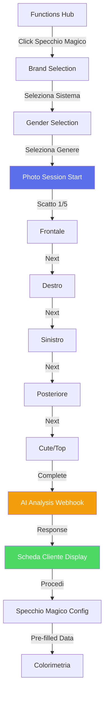

# 📸 Photo Session - Sistema Acquisizione Multi-Angolo

> **Ultima revisione**: 15 Dicembre 2025  
> **Path**: `/functions/photo-session.html`  
> **Status**: Production ✅

---

## 🎯 Obiettivo

Il **Photo Session** è un sistema di acquisizione fotografica professionale a **5 angolazioni** che precede lo Specchio Magico AI. Permette di catturare dati visivi completi del cliente per un'analisi AI approfondita che restituisce una **scheda diagnostica dettagliata**.

### Caratteristiche Chiave

- 📷 **5 scatti obbligatori**: frontale, destro, sinistro, posteriore, cute
- 👁️ **Guide visive overlay**: sagome posizionamento per ogni angolazione
- 💾 **Compressione intelligente**: JPEG quality 0.7, max 800px lato lungo
- 📱 **Upload alternativo**: possibilità di caricare da galleria per ogni scatto
- 🔒 **Single permission**: richiesta camera una sola volta (persistente)
- 🤖 **Analisi AI completa**: età, genere, pelle, capelli, consigli personalizzati
- 🔗 **Integrazione seamless**: dati pre-compilati in Specchio Magico

---

## 📊 Flow Completo



---

## 📸 Le 5 Angolazioni

### 1. **Frontale** 👤

**Obiettivo**: Viso completo, capelli visibili, espressione neutra

**Guide Overlay**: Ovale verticale (60% larghezza, 80% altezza)

**Dati estratti**:
- Età stimata (range)
- Genere rilevato (confidence %)
- Tono pelle + sottotono
- Forma viso
- Colore occhi
- Lunghezza capelli frontale

---

### 2. **Laterale Destro** ➡️

**Obiettivo**: Profilo 90°, linea mandibola, orecchio visibile

**Guide Overlay**: Ovale orizzontale (rotazione 90°)

**Dati estratti**:
- Profilo naso
- Linea mandibola
- Volume capelli laterale
- Attaccatura frontale

---

### 3. **Laterale Sinistro** ⬅️

**Obiettivo**: Profilo 90° opposto (per simmetria)

**Guide Overlay**: Ovale orizzontale (rotazione -90°)

**Dati estratti**:
- Conferma simmetria viso
- Volume capelli lato opposto
- Coerenza texture

---

### 4. **Posteriore** 👤

**Obiettivo**: Nuca, lunghezza capelli, linea spalle

**Guide Overlay**: Ovale verticale (più largo in basso)

**Dati estratti**:
- Lunghezza capelli reale
- Densità nuca
- Presenza diradamento
- Colore capelli (luce naturale)

---

### 5. **Cute/Top** 🧑‍🦲

**Obiettivo**: Zona superiore testa, radici, cute visibile

**Guide Overlay**: Cerchio (60% dimensione)

**Dati estratti**:
- Salute cute (secca, grassa, normale)
- Densità capelli (bassa, media, alta)
- % bianchi (rilevazione automatica)
- Presenza forfora/dermatiti
- Colore radici vs lunghezze

---

## 🛠️ Implementazione Tecnica

### Compressione JPEG Ottimizzata

```javascript
function compressImage(canvas, callback) {
  // Resize se troppo grande
  let width = canvas.width;
  let height = canvas.height;
  const maxDim = 800; // MAX 800px lato lungo
  
  if (width > maxDim || height > maxDim) {
    const scale = maxDim / Math.max(width, height);
    width *= scale;
    height *= scale;
    
    const tempCanvas = document.createElement('canvas');
    tempCanvas.width = width;
    tempCanvas.height = height;
    const tempCtx = tempCanvas.getContext('2d');
    tempCtx.drawImage(canvas, 0, 0, width, height);
    canvas = tempCanvas;
  }
  
  // Convert to JPEG quality 0.7
  const base64 = canvas.toDataURL('image/jpeg', 0.7);
  console.log(`📸 Compressed: ${(base64.length / 1024).toFixed(2)} KB`);
  callback(base64);
}
```

**Risultato**:
- Original 1920x1080 (1.2 MB) → Compressed 800x450 (~80 KB)
- **Riduzione 93%** mantenendo qualità visiva

---

### Camera Permission Strategy

**Problema**: Ogni volta che apri la camera, browser chiede consenso → esperienza pessima

**Soluzione**: Single permission request, stream persistente

```javascript
let cameraStream = null;

async function initCamera() {
  try {
    // Se stream già attivo, riusa
    if (cameraStream) {
      document.getElementById('camera-video').srcObject = cameraStream;
      return;
    }
    
    // Altrimenti richiedi UNA VOLTA
    const stream = await navigator.mediaDevices.getUserMedia({
      video: {
        facingMode: usingFrontCamera ? 'user' : 'environment',
        width: { ideal: 1280 },
        height: { ideal: 1920 }
      },
      audio: false
    });
    
    cameraStream = stream;
    document.getElementById('camera-video').srcObject = stream;
  } catch (error) {
    console.error('❌ Camera error:', error);
    alert('Usa il pulsante Upload da Galleria');
  }
}

function stopCamera() {
  if (cameraStream) {
    cameraStream.getTracks().forEach(track => track.stop());
    cameraStream = null;
  }
}
```

**Best Practice**:
1. Stream rimane attivo tra gli step (solo `display: none` su video)
2. Stop definitivo solo su completamento sessione o cancel
3. Fallback automatico a upload se permesso negato

---

## 🤖 AI Analysis Webhook

### Endpoint

```
POST https://trinai.api.workflow.dcmake.it/webhook/photo-session-analysis
```

### Request Payload

```json
{
  "owner": "telegram_user_id",
  "token": "session_token",
  "photos": {
    "front": "data:image/jpeg;base64,/9j/4AAQSkZJRg...",
    "right": "data:image/jpeg;base64,/9j/4AAQSkZJRg...",
    "left": "data:image/jpeg;base64,/9j/4AAQSkZJRg...",
    "back": "data:image/jpeg;base64,/9j/4AAQSkZJRg...",
    "scalp": "data:image/jpeg;base64,/9j/4AAQSkZJRg..."
  },
  "timestamp": 1734284400000
}
```

---

### Response (Success)

```json
{
  "success": true,
  "analysis": {
    "age": {
      "estimated": 34,
      "range": "30-40"
    },
    "gender": {
      "detected": "F",
      "confidence": 0.95
    },
    "skinTone": {
      "category": "Medium",
      "undertone": "Warm",
      "hex": "#d4a891"
    },
    "hairAnalysis": {
      "naturalColor": {
        "level": 5,
        "tone": "Warm Brown"
      },
      "texture": {
        "type": "2B",
        "porosity": "Medium"
      },
      "density": "Medium-High",
      "length": {
        "front": "chin",
        "back": "shoulder",
        "estimatedCm": 35
      },
      "greyPercentage": 15,
      "damage": {
        "level": "Low",
        "concerns": []
      },
      "scalpHealth": {
        "condition": "Normal",
        "oiliness": "Balanced",
        "issues": []
      }
    },
    "faceShape": "Oval",
    "facialFeatures": {
      "eyeColor": "Brown",
      "lipShape": "Full",
      "cheekbones": "High"
    },
    "recommendations": {
      "suitableHaircuts": [
        "Long Bob",
        "Layered Cut",
        "Shag"
      ],
      "colorSuggestions": [
        "Warm Tones",
        "Caramel Highlights",
        "Balayage Naturale"
      ],
      "avoidColors": [
        "Ash Tones",
        "Cool Platinum"
      ],
      "stylingTips": [
        "Prodotti volumizzanti su radici",
        "Evitare piastre sopra 180°C"
      ]
    }
  },
  "processingTime": 4.2
}
```

---

### Response (Error)

```json
{
  "success": false,
  "error": {
    "code": "ANALYSIS_FAILED",
    "message": "Foto frontale non valida: viso non rilevato",
    "details": {
      "photo": "front",
      "reason": "face_not_detected"
    }
  }
}
```

**Errori Possibili**:

| Codice | Causa | Fix |
|--------|-------|-----|
| `FACE_NOT_DETECTED` | Viso non riconosciuto | Ri-scattare foto frontale |
| `LOW_QUALITY` | Foto sfocata/scura | Migliorare illuminazione |
| `INCOMPLETE_SESSION` | Meno di 5 foto | Completare tutti gli scatti |
| `API_QUOTA_EXCEEDED` | Rate limit AI | Attendere 60 secondi |

---

## 📊 Scheda Cliente Display

### UI Card Structure

```html
<div class="analysis-card">
  <h3>🤖 Analisi AI Cliente</h3>
  
  <!-- DATI ANAGRAFICI -->
  <div class="analysis-grid">
    <div>
      <label>Età Stimata</label>
      <value>34 anni (30-40)</value>
    </div>
    <div>
      <label>Genere Rilevato</label>
      <value>Donna (95% confidence)</value>
    </div>
    <div>
      <label>Tono Pelle</label>
      <value>Medium <span class="skin-preview" style="background: #d4a891;"></span></value>
    </div>
    <div>
      <label>Sottotono</label>
      <value>Warm</value>
    </div>
  </div>
  
  <!-- ANALISI CAPELLI -->
  <div class="hair-analysis">
    <h4>✏️ Analisi Capelli</h4>
    <div class="analysis-grid">
      <div>
        <label>Colore Naturale</label>
        <value>Livello 5 - Warm Brown</value>
      </div>
      <div>
        <label>Texture</label>
        <value>2B (Medium Porosity)</value>
      </div>
      <div>
        <label>Densità</label>
        <value>Medium-High</value>
      </div>
      <div>
        <label>% Bianchi</label>
        <value>15%</value>
      </div>
    </div>
    <div>
      <label>Livello Danno</label>
      <value>Low (nessun concern)</value>
    </div>
  </div>
  
  <!-- CONSIGLI AI -->
  <div class="recommendations">
    <h4>💡 Consigli AI</h4>
    <ul>
      <li><strong>Tagli consigliati:</strong> Long Bob, Layered Cut, Shag</li>
      <li><strong>Colori suggeriti:</strong> Warm Tones, Caramel Highlights</li>
      <li><strong>Da evitare:</strong> Ash Tones, Cool Platinum</li>
    </ul>
  </div>
  
  <button onclick="proceedToColorimetry()">Procedi a Colorimetria</button>
</div>
```

---

## 🔗 Integrazione con Specchio Magico

### Data Transfer via SessionStorage

```javascript
// photo-session.html - Al completamento
function proceedToColorimetry() {
  sessionStorage.setItem('photoSessionData', JSON.stringify({
    photos: photos, // tutte e 5 le foto base64
    analysis: analysisData // oggetto completo AI response
  }));
  
  navigateWithParams('./specchio-magico.html', {
    owner: urlParams.owner,
    token: urlParams.token,
    system: urlParams.system || 'standard',
    gender: analysisData.gender.detected || 'F',
    fromPhotoSession: 'true'
  });
}
```

```javascript
// specchio-magico.js - All'init
window.addEventListener('DOMContentLoaded', () => {
  const urlParams = new URLSearchParams(window.location.search);
  
  if (urlParams.get('fromPhotoSession') === 'true') {
    const sessionData = sessionStorage.getItem('photoSessionData');
    
    if (sessionData) {
      const data = JSON.parse(sessionData);
      
      // Pre-fill campi da analisi AI
      autoFillFromAnalysis(data.analysis);
      
      // Usa foto frontale come client photo
      clientPhotoData = data.photos.front;
      
      // Skip brand/gender selection, vai diretto a config
      skipToConfig();
    }
  }
});

function autoFillFromAnalysis(analysis) {
  // Genere
  selectedGender = analysis.gender.detected;
  
  // Texture capelli
  const textureEl = document.getElementById('hair-texture');
  if (textureEl) {
    textureEl.value = analysis.hairAnalysis.texture.type;
  }
  
  // Tono base (dal colore naturale)
  currentBaseTone = analysis.hairAnalysis.naturalColor.level;
  document.getElementById('base-tone').value = currentBaseTone;
  
  // Blocca scelte pericolose se damage = High
  if (analysis.hairAnalysis.damage.level === 'High') {
    const techniqueEl = document.getElementById('color-technique');
    // Disabilita bleach-tone se capelli danneggiati
    Array.from(techniqueEl.options).forEach(opt => {
      if (opt.value === 'bleach-tone') {
        opt.disabled = true;
        opt.textContent += ' (⚠️ Sconsigliato - Capelli Danneggiati)';
      }
    });
  }
  
  // Suggerimenti colore
  displayAISuggestions(analysis.recommendations);
}
```

---

## 📊 Metriche

### Performance Targets

| Metrica | Target | Note |
|---------|--------|------|
| **Tempo per scatto** | < 5s | Include posizionamento + capture |
| **Sessione completa** | < 2 min | 5 scatti + AI analysis |
| **AI Analysis** | < 5s | Webhook processing time |
| **Dimensione foto** | ~80 KB | JPEG compressed, per foto |
| **Payload totale** | ~400 KB | 5 foto base64 |

### Business KPIs

- **Completion Rate**: % sessioni completate (target 85%)
- **Photo Quality**: % foto accettate da AI (target 95%)
- **Retake Rate**: % foto ri-scattate (target < 15%)
- **Skip Rate**: % utenti che skippano photo session (target < 5%)

---

## 🛠️ Troubleshooting

### ⚠️ Camera Permission Denied

**Sintomo**: Alert "Impossibile accedere alla camera"

**Cause**:
1. Utente ha negato permesso
2. Browser non supporta getUserMedia
3. HTTPS non attivo (richiesto per camera API)

**Fix**:
- Mostra messaggio: "Usa il pulsante Upload da Galleria"
- Fallback automatico a upload mode
- Guide utente per resettare permessi browser

---

### 📸 Foto Sfocate/Scure

**Sintomo**: AI ritorna `LOW_QUALITY` error

**Cause**:
1. Illuminazione insufficiente
2. Mano tremante durante scatto
3. Camera low-res su device vecchi

**Fix**:
- Mostra tip pre-scatto: "💡 Assicurati di avere buona luce"
- Attiva flash se disponibile
- Permetti retake illimitati senza penali

---

### 🔄 Upload da Galleria Non Funziona

**Sintomo**: File selector non si apre o foto non carica

**Cause**:
1. iOS bug con `<input type="file">`
2. Permessi storage negati
3. File troppo grande (> 10 MB)

**Fix**:
```javascript
// Aggiungi validazione size
function uploadPhoto(event) {
  const file = event.target.files[0];
  if (!file) return;
  
  // Max 10 MB
  if (file.size > 10 * 1024 * 1024) {
    alert('⚠️ File troppo grande. Max 10 MB.');
    return;
  }
  
  // iOS: trigger click programmatically
  const input = event.target;
  input.click();
  
  // ... resto del codice
}
```

---

## 🚀 Roadmap

### Q1 2025 ✅
- [x] Sistema 5 scatti con guide overlay
- [x] Compressione JPEG ottimizzata
- [x] Upload da galleria alternativo
- [x] AI analysis webhook integration
- [x] Scheda cliente display

### Q2 2025 🚧
- [ ] **Video tutorial** in-app per ogni angolazione
- [ ] **Auto-capture**: rileva viso correttamente posizionato e scatta auto
- [ ] **Mirror mode**: effetto specchio per selfie (flip orizzontale)
- [ ] **Beauty mode OFF**: disabilita filtri beauty nativi device
- [ ] **Grid overlay**: linee guida thirds rule

### Q3 2025 📋
- [ ] **Batch upload**: carica tutte 5 foto insieme da galleria
- [ ] **AR try-on preview**: anteprima colori in real-time (AR.js)
- [ ] **Hair length detector**: misura automatica cm capelli
- [ ] **Scalp health score**: punteggio 0-100 salute cute

---

## 📚 Documentazione Correlata

- [01-OVERVIEW.md](./01-OVERVIEW.md) - Panoramica SiteBoS
- [12-FUNCTIONS-HUB.md](./12-FUNCTIONS-HUB.md) - Specchio Magico AI
- [06-CATALOG.md](./06-CATALOG.md) - AI Vision integration

---

<div align="center">

**Photo Session - Powered by TrinAI**

*Analisi AI professionale in 2 minuti*

---

[⬆ Torna alla documentazione](./README.md)

</div>