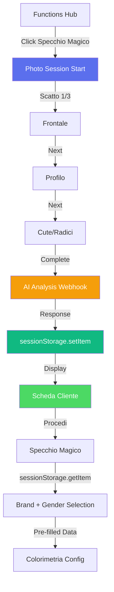

# 📸 Photo Session - Sistema Acquisizione 3 Angolazioni

> **Ultima revisione**: 15 Dicembre 2025  
> **Path**: `/functions/photo-session.html`  
> **Status**: Production ✅

---

## 🎯 Obiettivo

Il **Photo Session** è un sistema di acquisizione fotografica professionale a **3 angolazioni** che precede lo Specchio Magico AI. Permette di catturare dati visivi essenziali del cliente per un'analisi AI completa che restituisce una **scheda diagnostica dettagliata** salvata temporaneamente in **sessionStorage**.

### Caratteristiche Chiave

- 📷 **3 scatti essenziali**: frontale, profilo, cute
- 👁️ **Guide visive overlay**: sagome posizionamento per ogni angolazione
- 💾 **Compressione intelligente**: JPEG quality 0.7, max 800px lato lungo
- 📱 **Upload alternativo**: possibilità di caricare da galleria per ogni scatto
- 🔒 **Single permission**: richiesta camera una sola volta (persistente)
- 🤖 **Analisi AI completa**: età, genere, pelle, capelli, consigli personalizzati
- ⚡ **SessionStorage**: dati volatili, auto-expire dopo sessione
- 🔗 **Integrazione seamless**: dati pre-compilati in Specchio Magico

---

## 📊 Flow Completo



**Perché NO MongoDB?**
- ⚡ Dati troppo volatili (età cambia, capelli crescono)
- 💰 Storage cost inutile per dati temporanei
- 🔄 Ogni sessione è fresh (30 secondi per 3 foto)
- 🧹 Auto-cleanup garantito (browser expiry)

---

## 📸 Le 3 Angolazioni Essenziali

### 1. **Frontale** 👤

**Obiettivo**: Viso completo, capelli visibili, espressione neutra

**Guide Overlay**: Ovale verticale (60% larghezza, 80% altezza)

**Dati estratti**:
- Età stimata (range)
- Genere rilevato (confidence %)
- Tono pelle + sottotono (hex color)
- Forma viso (oval, square, heart, round)
- Colore occhi
- Lunghezza capelli frontale
- Features facciali (cheekbones, lip shape)

---

### 2. **Profilo** ↗️

**Obiettivo**: Laterale 90°, linea mandibola visibile, orecchio inquadrato

**Guide Overlay**: Ovale orizzontale (rotazione 90°)

**Dati estratti**:
- Profilo naso
- Linea mandibola
- Volume capelli laterale
- Attaccatura frontale/temporale
- Texture capelli (ricci/lisci/ondulati)
- Lunghezza effettiva capelli

---

### 3. **Cute/Radici** 🔍

**Obiettivo**: Zona superiore testa, radici ben visibili, cute inquadrata

**Guide Overlay**: Cerchio (60% dimensione)

**Dati estratti**:
- Salute cute (secca, grassa, normale)
- Densità capelli (bassa, media, alta)
- % bianchi (rilevazione automatica pixel saturation)
- Presenza forfora/dermatiti
- Colore naturale radici
- Contrasto radici/lunghezze (ricrescita)
- Porosità stimata

---

## 🛠️ Implementazione Tecnica

### Compressione JPEG Ottimizzata

```javascript
function compressImage(canvas, callback) {
  let width = canvas.width;
  let height = canvas.height;
  const maxDim = 800;
  
  if (width > maxDim || height > maxDim) {
    const scale = maxDim / Math.max(width, height);
    width *= scale;
    height *= scale;
    
    const tempCanvas = document.createElement('canvas');
    tempCanvas.width = width;
    tempCanvas.height = height;
    const tempCtx = tempCanvas.getContext('2d');
    tempCtx.drawImage(canvas, 0, 0, width, height);
    canvas = tempCanvas;
  }
  
  const base64 = canvas.toDataURL('image/jpeg', 0.7);
  console.log(`📸 Compressed: ${(base64.length / 1024).toFixed(2)} KB`);
  callback(base64);
}
```

**Risultato**:
- Original 1920x1080 (1.2 MB) → Compressed 800x450 (~80 KB)
- **Riduzione 93%** mantenendo qualità visiva
- **Payload totale 3 foto**: ~240 KB

---

### SessionStorage Architecture

```javascript
// photo-session.html - Dopo AI response
function saveToSessionStorage() {
  const sessionData = {
    clientId: clientId,
    photos: {
      front: photos.front,
      profile: photos.profile,
      scalp: photos.scalp
    },
    analysis: analysisData,
    timestamp: Date.now()
  };
  
  sessionStorage.setItem('photoSessionData', JSON.stringify(sessionData));
  console.log('💾 Saved to sessionStorage');
}

// specchio-magico.html - All'init
if (urlParams.get('fromPhotoSession') === 'true') {
  const sessionData = sessionStorage.getItem('photoSessionData');
  
  if (sessionData) {
    const data = JSON.parse(sessionData);
    
    // Pre-fill tutto
    clientPhotoData = data.photos.front;
    autoFillFromAnalysis(data.analysis);
    selectedGender = data.analysis.gender.detected;
  }
}
```

**Vantaggi**:
- ⚡ Zero latency (localStorage in-browser)
- 🔒 Privacy-first (nessun dato server-side)
- 🧹 Auto-cleanup (expiry chiusura tab)
- 💰 Zero costi storage

---

## 🤖 AI Analysis Webhook

### Endpoint

```
POST https://trinai.api.workflow.dcmake.it/webhook/5364bb15-4186-4246-8d00-c82218f5e407
```

### Request Payload

```json
{
  "action": "analyze",
  "owner": "telegram_user_id",
  "token": "session_token",
  "photos": {
    "front": "data:image/jpeg;base64,/9j/4AAQSkZJRg...",
    "profile": "data:image/jpeg;base64,/9j/4AAQSkZJRg...",
    "scalp": "data:image/jpeg;base64,/9j/4AAQSkZJRg..."
  },
  "timestamp": 1734284400000
}
```

**Dimensione payload**: ~240 KB (3 foto compresse)

---

### Response (Success)

```json
{
  "success": true,
  "analysis": {
    "age": {
      "estimated": 34,
      "range": "30-40"
    },
    "gender": {
      "detected": "F",
      "confidence": 0.95
    },
    "skinTone": {
      "category": "Medium",
      "undertone": "Warm",
      "hex": "#d4a891"
    },
    "hairAnalysis": {
      "naturalColor": {
        "level": 5,
        "tone": "Warm Brown"
      },
      "texture": {
        "type": "2B",
        "porosity": "Medium"
      },
      "density": "Medium-High",
      "greyPercentage": 15,
      "damage": {
        "level": "Low",
        "concerns": []
      }
    },
    "faceShape": "Oval",
    "recommendations": {
      "suitableHaircuts": [
        "Long Bob",
        "Layered Cut"
      ],
      "colorSuggestions": [
        "Warm Tones",
        "Caramel Highlights"
      ],
      "avoidColors": [
        "Ash Tones",
        "Cool Platinum"
      ]
    }
  },
  "processingTime": 3.8
}
```

**Note**:
- ❌ **NO** foto nel response (già salvate client-side)
- ✅ Solo `analysis` object
- Frontend riusa foto da variabile `photos`

---

### Response (Error)

```json
{
  "success": false,
  "error": {
    "code": "FACE_NOT_DETECTED",
    "message": "Viso non rilevato in foto frontale",
    "photo": "front"
  }
}
```

**Error Codes**:

| Codice | Causa | Fix |
|--------|-------|-----|
| `FACE_NOT_DETECTED` | Viso non riconosciuto | Ri-scattare frontale |
| `LOW_QUALITY` | Foto sfocata/scura | Migliorare illuminazione |
| `INVALID_PAYLOAD` | Payload malformato | Check base64 encoding |
| `API_QUOTA_EXCEEDED` | Rate limit AI | Attendere 60s |

---

## 🔗 Integrazione con Specchio Magico

### Navigation URL

```javascript
function proceedToColorimetry() {
  const urlParams = getURLParams();
  
  navigateWithParams('./specchio-magico.html', {
    owner: urlParams.owner,
    token: urlParams.token,
    gender: analysisData.gender.detected || 'F',
    fromPhotoSession: 'true' // <<< FLAG
  });
}
```

### Specchio Magico Load

```javascript
// specchio-magico.js - All'init
window.addEventListener('DOMContentLoaded', () => {
  const urlParams = new URLSearchParams(window.location.search);
  
  if (urlParams.get('fromPhotoSession') === 'true') {
    const sessionData = sessionStorage.getItem('photoSessionData');
    
    if (sessionData) {
      const data = JSON.parse(sessionData);
      
      // 1. Usa foto frontale come preview cliente
      clientPhotoData = data.photos.front;
      document.getElementById('client-photo').src = clientPhotoData;
      
      // 2. Pre-fill gender
      selectedGender = data.analysis.gender.detected;
      
      // 3. Auto-fill texture capelli
      document.getElementById('hair-texture').value = 
        data.analysis.hairAnalysis.texture.type;
      
      // 4. Set tono base da colore naturale
      currentBaseTone = data.analysis.hairAnalysis.naturalColor.level;
      document.getElementById('base-tone').value = currentBaseTone;
      
      // 5. Blocca tecniche pericolose se damage = High
      if (data.analysis.hairAnalysis.damage.level === 'High') {
        blockDangerousTechniques();
      }
      
      // 6. Mostra consigli AI
      displayAISuggestions(data.analysis.recommendations);
      
      // 7. Skip brand selection se preferito
      // skipToBrandSelection();
    }
  }
});
```

---

## 📊 Metriche

### Performance Targets

| Metrica | Target | Note |
|---------|--------|------|
| **Tempo sessione** | < 1 min | 3 foto + AI |
| **Tempo per scatto** | < 5s | Include posizionamento |
| **AI Analysis** | < 4s | Webhook processing |
| **Dimensione foto** | ~80 KB | Per foto |
| **Payload totale** | ~240 KB | 3 foto base64 |
| **Completion Rate** | 90% | Target vs 85% con 5 foto |
| **SessionStorage size** | ~250 KB | Foto + analysis |

### Business KPIs

- **Completion Rate**: % sessioni completate (target 90%)
- **Photo Quality**: % foto accettate da AI (target 95%)
- **Retake Rate**: % foto ri-scattate (target < 12%)
- **Time to First Service**: da photo session a colorimetria (target < 3 min)
- **AI Accuracy**: precision età ±5 anni (target 85%)

---

## 🛠️ Troubleshooting

### ⚠️ Camera Permission Denied

**Causa**: Utente ha negato permesso browser

**Fix**:
- Mostra fallback automatico: "Usa Upload da Galleria"
- Guide per resettare permessi (Settings → Privacy)

---

### 📸 Foto Sfocate

**Causa**: Illuminazione insufficiente, mano tremante

**Fix**:
- Tip pre-scatto: "💡 Assicurati di avere buona luce"
- Retake illimitati

---

### 🔴 AI Returns "FACE_NOT_DETECTED"

**Causa**: Viso non riconosciuto in foto frontale

**Fix**:
- Mostra errore specifico: "Viso non rilevato. Ri-scatta foto frontale."
- Auto-jump a step 1 (frontale)

---

### 💾 SessionStorage Vuoto in Specchio Magico

**Causa**: Tab chiuso e riaperto, sessionStorage cleared

**Fix**:
- Mostra alert: "Dati analisi scaduti. Ripeti photo session."
- Redirect automatico a photo-session.html

---

## 🚀 Roadmap

### Q1 2025 ✅
- [x] Sistema 3 scatti con guide overlay
- [x] Compressione JPEG ottimizzata
- [x] Upload da galleria alternativo
- [x] AI analysis webhook
- [x] SessionStorage integration
- [x] Correct webhook URL

### Q2 2025 🚧
- [ ] **Auto-capture**: rileva posizionamento corretto e scatta automaticamente
- [ ] **Mirror mode**: flip orizzontale per selfie
- [ ] **Grid overlay**: linee guida rule of thirds
- [ ] **Client history**: lista ultimi 10 clienti analizzati (localStorage)

### Q3 2025 📋
- [ ] **Batch photos**: carica tutte 3 foto insieme
- [ ] **Hair length measurement**: misura automatica cm capelli
- [ ] **Scalp health score**: punteggio 0-100
- [ ] **Before/After comparison**: side-by-side in results

---

## 📚 Documentazione Correlata

- [01-OVERVIEW.md](./01-OVERVIEW.md) - Panoramica SiteBoS
- [12-FUNCTIONS-HUB.md](./12-FUNCTIONS-HUB.md) - Specchio Magico AI
- [06-CATALOG.md](./06-CATALOG.md) - AI Vision integration

---

<div align="center">

**Photo Session - Powered by TrinAI**

*Analisi AI professionale in 1 minuto con 3 foto*

*SessionStorage-only • Zero persistence • Privacy-first*

---

[⬆ Torna alla documentazione](./README.md)

</div>