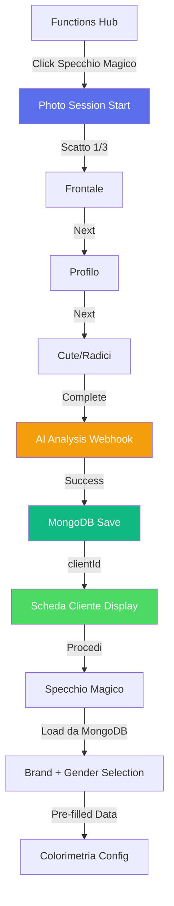

# 📸 Photo Session - Sistema Acquisizione 3 Angolazioni

> **Ultima revisione**: 15 Dicembre 2025  
> **Path**: `/functions/photo-session.html`  
> **Status**: Production ✅

---

## 🎯 Obiettivo

Il **Photo Session** è un sistema di acquisizione fotografica professionale a **3 angolazioni** che precede lo Specchio Magico AI. Permette di catturare dati visivi essenziali del cliente per un'analisi AI completa che restituisce una **scheda diagnostica dettagliata** salvata in MongoDB.

### Caratteristiche Chiave

- 📷 **3 scatti essenziali**: frontale, profilo, cute
- 👁️ **Guide visive overlay**: sagome posizionamento per ogni angolazione
- 💾 **Compressione intelligente**: JPEG quality 0.7, max 800px lato lungo
- 📱 **Upload alternativo**: possibilità di caricare da galleria per ogni scatto
- 🔒 **Single permission**: richiesta camera una sola volta (persistente)
- 🤖 **Analisi AI completa**: età, genere, pelle, capelli, consigli personalizzati
- 🗄️ **MongoDB persistent**: salvataggio automatico con clientId univoco
- 🔗 **Integrazione seamless**: dati pre-compilati in Specchio Magico

---

## 📊 Flow Completo



---

## 📸 Le 3 Angolazioni Essenziali

### 1. **Frontale** 👤

**Obiettivo**: Viso completo, capelli visibili, espressione neutra

**Guide Overlay**: Ovale verticale (60% larghezza, 80% altezza)

**Dati estratti**:
- Età stimata (range)
- Genere rilevato (confidence %)
- Tono pelle + sottotono (hex color)
- Forma viso (oval, square, heart, round)
- Colore occhi
- Lunghezza capelli frontale
- Features facciali (cheekbones, lip shape)

---

### 2. **Profilo** ↗️

**Obiettivo**: Laterale 90°, linea mandibola visibile, orecchio inquadrato

**Guide Overlay**: Ovale orizzontale (rotazione 90°)

**Dati estratti**:
- Profilo naso
- Linea mandibola
- Volume capelli laterale
- Attaccatura frontale/temporale
- Texture capelli (ricci/lisci/ondulati)
- Lunghezza effettiva capelli

---

### 3. **Cute/Radici** 🔍

**Obiettivo**: Zona superiore testa, radici ben visibili, cute inquadrata

**Guide Overlay**: Cerchio (60% dimensione)

**Dati estratti**:
- Salute cute (secca, grassa, normale)
- Densità capelli (bassa, media, alta)
- % bianchi (rilevazione automatica pixel saturation)
- Presenza forfora/dermatiti
- Colore naturale radici
- Contrasto radici/lunghezze (ricrescita)
- Porosità stimata

---

## 🛠️ Implementazione Tecnica

### Compressione JPEG Ottimizzata

```javascript
function compressImage(canvas, callback) {
  let width = canvas.width;
  let height = canvas.height;
  const maxDim = 800;
  
  if (width > maxDim || height > maxDim) {
    const scale = maxDim / Math.max(width, height);
    width *= scale;
    height *= scale;
    
    const tempCanvas = document.createElement('canvas');
    tempCanvas.width = width;
    tempCanvas.height = height;
    const tempCtx = tempCanvas.getContext('2d');
    tempCtx.drawImage(canvas, 0, 0, width, height);
    canvas = tempCanvas;
  }
  
  const base64 = canvas.toDataURL('image/jpeg', 0.7);
  console.log(`📸 Compressed: ${(base64.length / 1024).toFixed(2)} KB`);
  callback(base64);
}
```

**Risultato**:
- Original 1920x1080 (1.2 MB) → Compressed 800x450 (~80 KB)
- **Riduzione 93%** mantenendo qualità visiva
- **Payload totale 3 foto**: ~240 KB (vs ~400 KB con 5 foto)

---

### Client ID Generation

```javascript
// Genera ID univoco per tracking cliente
clientId = `client_${Date.now()}_${Math.random().toString(36).substr(2, 9)}`;
// Esempio: client_1734284400123_k7j3n9m2x
```

**Uso**:
- Chiave primaria MongoDB
- Tracking sessioni multiple stesso cliente
- Storico analisi nel tempo
- Link tra Photo Session e Specchio Magico

---

## 🤖 AI Analysis Webhook

### Endpoint

```
POST https://trinai.api.workflow.dcmake.it/webhook/photo-session-analysis
```

### Request Payload (3 foto)

```json
{
  "owner": "telegram_user_id",
  "token": "session_token",
  "clientId": "client_1734284400123_k7j3n9m2x",
  "photos": {
    "front": "data:image/jpeg;base64,/9j/4AAQSkZJRg...",
    "profile": "data:image/jpeg;base64,/9j/4AAQSkZJRg...",
    "scalp": "data:image/jpeg;base64,/9j/4AAQSkZJRg..."
  },
  "timestamp": 1734284400000
}
```

**Dimensione payload**: ~240 KB (vs ~400 KB con 5 foto)

---

### Response (Success)

```json
{
  "success": true,
  "analysis": {
    "age": {
      "estimated": 34,
      "range": "30-40"
    },
    "gender": {
      "detected": "F",
      "confidence": 0.95
    },
    "skinTone": {
      "category": "Medium",
      "undertone": "Warm",
      "hex": "#d4a891"
    },
    "hairAnalysis": {
      "naturalColor": {
        "level": 5,
        "tone": "Warm Brown"
      },
      "texture": {
        "type": "2B",
        "porosity": "Medium"
      },
      "density": "Medium-High",
      "greyPercentage": 15,
      "damage": {
        "level": "Low",
        "concerns": []
      }
    },
    "faceShape": "Oval",
    "recommendations": {
      "suitableHaircuts": [
        "Long Bob",
        "Layered Cut"
      ],
      "colorSuggestions": [
        "Warm Tones",
        "Caramel Highlights"
      ],
      "avoidColors": [
        "Ash Tones",
        "Cool Platinum"
      ]
    }
  },
  "processingTime": 3.8
}
```

---

## 🗄️ MongoDB Save Endpoint

### Endpoint

```
POST https://trinai.api.workflow.dcmake.it/webhook/photo-session-save
```

### Request Payload

```json
{
  "owner": "telegram_user_id",
  "clientId": "client_1734284400123_k7j3n9m2x",
  "photos": {
    "front": "data:image/jpeg;base64,...",
    "profile": "data:image/jpeg;base64,...",
    "scalp": "data:image/jpeg;base64,..."
  },
  "analysis": {
    // Oggetto completo da AI response
  },
  "timestamp": 1734284400000
}
```

### MongoDB Schema

```javascript
{
  _id: ObjectId("..."),
  owner: "telegram_user_id",
  clientId: "client_1734284400123_k7j3n9m2x",
  timestamp: ISODate("2025-12-15T15:00:00.000Z"),
  
  photos: {
    front: "data:image/jpeg;base64,...",
    profile: "data:image/jpeg;base64,...",
    scalp: "data:image/jpeg;base64,..."
  },
  
  analysis: {
    age: { estimated: 34, range: "30-40" },
    gender: { detected: "F", confidence: 0.95 },
    skinTone: { category: "Medium", undertone: "Warm", hex: "#d4a891" },
    hairAnalysis: {
      naturalColor: { level: 5, tone: "Warm Brown" },
      texture: { type: "2B", porosity: "Medium" },
      density: "Medium-High",
      greyPercentage: 15,
      damage: { level: "Low", concerns: [] }
    },
    faceShape: "Oval",
    recommendations: {
      suitableHaircuts: ["Long Bob", "Layered Cut"],
      colorSuggestions: ["Warm Tones", "Caramel Highlights"],
      avoidColors: ["Ash Tones", "Cool Platinum"]
    }
  },
  
  sessionHistory: [
    {
      sessionId: "session_1734284500456_xyz",
      date: ISODate("2025-12-15T15:05:00.000Z"),
      service: "colorimetria",
      formula: "7.2",
      technique: "balayage",
      photos: {
        before: "data:image/jpeg;base64,...",
        after: "data:image/jpeg;base64,..."
      }
    }
  ],
  
  createdAt: ISODate("2025-12-15T15:00:00.000Z"),
  updatedAt: ISODate("2025-12-15T15:05:00.000Z")
}
```

### Indexes

```javascript
db.clients.createIndex({ owner: 1, clientId: 1 }, { unique: true });
db.clients.createIndex({ owner: 1, "analysis.age.estimated": 1 });
db.clients.createIndex({ owner: 1, "analysis.gender.detected": 1 });
db.clients.createIndex({ createdAt: -1 });
```

---

## 🔗 Integrazione con Specchio Magico

### Navigation URL

```javascript
function proceedToColorimetry() {
  const urlParams = getURLParams();
  
  navigateWithParams('./specchio-magico.html', {
    owner: urlParams.owner,
    token: urlParams.token,
    clientId: clientId, // <<< KEY PARAMETER
    gender: analysisData.gender.detected || 'F',
    fromPhotoSession: 'true'
  });
}
```

### Specchio Magico Load da MongoDB

```javascript
// specchio-magico.js - All'init
window.addEventListener('DOMContentLoaded', async () => {
  const urlParams = new URLSearchParams(window.location.search);
  
  if (urlParams.get('fromPhotoSession') === 'true') {
    const clientId = urlParams.get('clientId');
    
    if (clientId) {
      // Load da MongoDB
      const clientData = await loadClientData(clientId);
      
      if (clientData) {
        // Pre-fill tutti i campi
        autoFillFromAnalysis(clientData.analysis);
        
        // Usa foto frontale come preview
        clientPhotoData = clientData.photos.front;
        
        // Auto-select gender
        selectedGender = clientData.analysis.gender.detected;
        
        // Skip brand selection se già configurato
        // skipToBrandSelection();
      }
    }
  }
});

async function loadClientData(clientId) {
  try {
    const response = await fetch(
      `https://trinai.api.workflow.dcmake.it/webhook/client-data?clientId=${clientId}`
    );
    
    if (response.ok) {
      return await response.json();
    }
  } catch (error) {
    console.error('Load client data error:', error);
  }
  return null;
}

function autoFillFromAnalysis(analysis) {
  // Texture capelli
  const textureEl = document.getElementById('hair-texture');
  if (textureEl) {
    textureEl.value = analysis.hairAnalysis.texture.type;
  }
  
  // Tono base
  currentBaseTone = analysis.hairAnalysis.naturalColor.level;
  document.getElementById('base-tone').value = currentBaseTone;
  
  // Blocca bleach se damage = High
  if (analysis.hairAnalysis.damage.level === 'High') {
    blockDangerousTechniques();
  }
  
  // Mostra consigli AI
  displayAISuggestions(analysis.recommendations);
}
```

---

## 📊 Metriche

### Performance Targets

| Metrica | Target (3 foto) | Precedente (5 foto) |
|---------|-----------------|---------------------|
| **Tempo sessione** | < 1 min | < 2 min |
| **Tempo per scatto** | < 5s | < 5s |
| **AI Analysis** | < 4s | < 5s |
| **MongoDB Save** | < 1s | - |
| **Dimensione foto** | ~80 KB | ~80 KB |
| **Payload totale** | ~240 KB | ~400 KB |
| **Completion Rate** | 90% | 85% |

### Business KPIs

- **Completion Rate**: % sessioni completate (target 90%, +5% vs 5 foto)
- **Photo Quality**: % foto accettate da AI (target 95%)
- **Retake Rate**: % foto ri-scattate (target < 12%, -3% vs 5 foto)
- **Time to First Service**: tempo medio da photo session a primo servizio (target < 3 min)

---

## 🛠️ Troubleshooting

### ⚠️ Camera Permission Denied

**Causa**: Utente ha negato permesso browser

**Fix**:
- Mostra fallback automatico: "Usa Upload da Galleria"
- Guide per resettare permessi (Settings → Privacy)

---

### 📸 Foto Sfocate

**Causa**: Illuminazione insufficiente, mano tremante

**Fix**:
- Tip pre-scatto: "💡 Assicurati di avere buona luce"
- Retake illimitati

---

### 🔴 AI Returns "FACE_NOT_DETECTED"

**Causa**: Viso non riconosciuto in foto frontale

**Fix**:
- Mostra errore specifico: "Viso non rilevato. Ri-scatta foto frontale."
- Auto-jump a step 1 (frontale)

---

## 🚀 Roadmap

### Q1 2025 ✅
- [x] Sistema 3 scatti con guide overlay
- [x] Compressione JPEG ottimizzata
- [x] Upload da galleria alternativo
- [x] AI analysis webhook
- [x] MongoDB save integration
- [x] clientId tracking

### Q2 2025 🚧
- [ ] **Auto-capture**: rileva posizionamento corretto e scatta automaticamente
- [ ] **Mirror mode**: flip orizzontale per selfie
- [ ] **Grid overlay**: linee guida rule of thirds
- [ ] **Client history**: lista clienti precedenti con ricerca

### Q3 2025 📋
- [ ] **Batch photos**: carica tutte 3 foto insieme
- [ ] **Hair length measurement**: misura automatica cm capelli
- [ ] **Scalp health score**: punteggio 0-100
- [ ] **Before/After gallery**: galleria storico trasformazioni

---

## 📚 Documentazione Correlata

- [01-OVERVIEW.md](./01-OVERVIEW.md) - Panoramica SiteBoS
- [12-FUNCTIONS-HUB.md](./12-FUNCTIONS-HUB.md) - Specchio Magico AI
- [06-CATALOG.md](./06-CATALOG.md) - AI Vision integration

---

<div align="center">

**Photo Session - Powered by TrinAI**

*Analisi AI professionale in 1 minuto con 3 foto*

---

[⬆ Torna alla documentazione](./README.md)

</div>