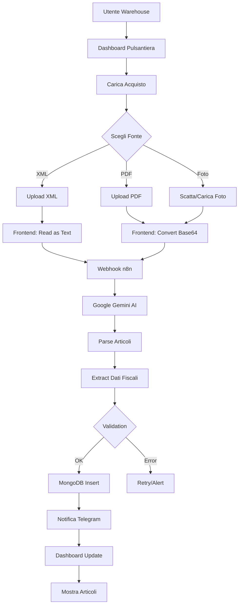
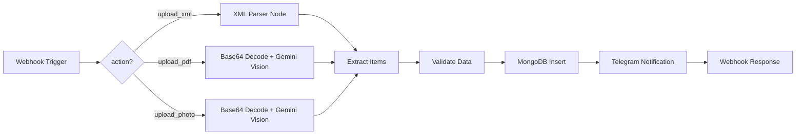

# 🏭 Warehouse Manager - Gestione Magazzino AI-Powered

> **Ultima revisione**: 22 Gennaio 2026  
> **Path**: `/warehouse/`  
> **Status**: Production ✅ (Upload System) | Beta 🚧 (Dashboard)

---

## 🎯 Obiettivo

Il **Warehouse Manager** è un sistema di gestione magazzino intelligente che automatizza il carico degli articoli tramite **AI OCR e parsing fiscale**.

### Caratteristiche Chiave

- 📝 **3 Fonti Upload**: Fattura XML, PDF, Foto ricevuta fiscale
- 🤖 **AI Automatica**: Google Gemini per OCR + parsing dati
- 🧠 **Aspetto Fiscale**: IVA, codici articolo, quantità, prezzi
- 📦 **Zero Input Manuale**: nessuna digitazione richiesta
- 📊 **Dashboard Real-time**: visualizzazione inventario completo
- 🔔 **Alert Giacenza**: notifiche scorte minime

### Differenza vs Magazzino Tradizionale

| Sistema Tradizionale | SiteBoS Warehouse Manager |
|----------------------|---------------------------|
| Inserimento manuale articoli | **Upload automatico da documenti** |
| Errori di digitazione | **AI validation + zero errori** |
| Tempo: 10-15 min/fattura | **Tempo: 30 secondi (automatico)** |
| Solo dati quantità | **Dati fiscali completi (IVA, cod.)** |
| Software costosi | **Integrato in SiteBoS** |

---

## 📊 Architettura Sistema

### Flow Completo



### Stack Tecnologico

| Layer | Tecnologia | Responsabilità |
|-------|------------|------------------|
| **Frontend** | HTML5/CSS3/JS | UI upload, tab navigation, file handling |
| **File Processing** | FileReader API | XML text read, PDF/Photo base64 encoding |
| **Orchestrator** | n8n Workflow | Routing, validation, error handling |
| **AI Engine** | Google Gemini Vision + Text | OCR, parsing, entity extraction |
| **Storage** | MongoDB | Articoli, movimenti, storico |
| **Notifiche** | Telegram Bot API | Real-time user feedback |

---

## 📦 Modulo Upload

### 1. Fattura XML

#### Cosa Supporta
- ✅ Fattura Elettronica Italiana (FatturaPA)
- ✅ XML standard B2B/B2C
- ✅ File multipli (batch upload - future)

#### Dati Estratti

```xml
<!-- Esempio struttura XML -->
<FatturaElettronica>
  <FatturaElettronicaBody>
    <DatiGenerali>
      <DatiGeneraliDocumento>
        <TipoDocumento>TD01</TipoDocumento>
        <Numero>123/2026</Numero>
        <Data>2026-01-22</Data>
      </DatiGeneraliDocumento>
    </DatiGenerali>
    <DatiBeniServizi>
      <DettaglioLinee>
        <NumeroLinea>1</NumeroLinea>
        <Descrizione>Prodotto XYZ</Descrizione>
        <Quantita>10.00</Quantita>
        <PrezzoUnitario>25.50</PrezzoUnitario>
        <AliquotaIVA>22.00</AliquotaIVA>
        <CodiceArticolo>ART-001</CodiceArticolo>
      </DettaglioLinee>
    </DatiBeniServizi>
  </FatturaElettronicaBody>
</FatturaElettronica>
```

#### Payload Webhook

```json
{
  "action": "upload_xml",
  "vat": "IT12345678901",
  "session_id": "session_1737536388_abc123",
  "filename": "fattura_2026_001.xml",
  "xml_content": "<?xml version=\"1.0\"?>...",
  "timestamp": "2026-01-22T08:19:48.000Z"
}
```

#### AI Processing (n8n + Gemini)

1. **Parse XML**: Estrai tag `<DettaglioLinee>`
2. **Extract Entities**: Descrizione, Quantità, Prezzo, IVA, Codice
3. **Normalize Data**: Converti tipi, valida range
4. **Generate MongoDB Doc**:

```javascript
{
  _id: ObjectId(),
  owner_vat: "IT12345678901",
  source: "xml",
  invoice_number: "123/2026",
  invoice_date: ISODate("2026-01-22"),
  items: [
    {
      line_number: 1,
      description: "Prodotto XYZ",
      quantity: 10,
      unit_price: 25.50,
      vat_rate: 22,
      item_code: "ART-001",
      total: 255.00,
      total_with_vat: 311.10
    }
  ],
  status: "processed",
  created_at: ISODate("2026-01-22T08:20:00Z")
}
```

---

### 2. Fattura PDF

#### Cosa Supporta
- ✅ PDF scansionati (OCR necessario)
- ✅ PDF nativi (text-based)
- ✅ Layout multipli (fatture diverse fornitori)

#### Dati Estratti
- 📄 Numero fattura, Data
- 📦 Lista articoli (descrizione, quantità, prezzo)
- 💰 Totali parziali, IVA, totale generale
- 🏷️ Codici articolo (se presenti)

#### Payload Webhook

```json
{
  "action": "upload_pdf",
  "vat": "IT12345678901",
  "session_id": "session_1737536388_abc123",
  "filename": "fattura_fornitore.pdf",
  "mimetype": "application/pdf",
  "file_base64": "JVBERi0xLjQKJeLjz9MK...",
  "timestamp": "2026-01-22T08:19:48.000Z"
}
```

#### AI Processing (Gemini Vision)

1. **OCR PDF**: Gemini Vision legge il documento
2. **Entity Extraction**: Prompt specializzato per fatture

```
PROMPT GEMINI:
"Analizza questa fattura PDF ed estrai:
1. Numero e data fattura
2. Lista articoli con: descrizione, quantità, prezzo unitario, IVA
3. Totali parziali e generali
4. Codici articolo (se presenti)

Risposta in JSON format."
```

3. **Validation**: Controlla coerenza totali
4. **MongoDB Insert**: Stessa struttura XML

---

### 3. Foto Ricevuta Fiscale

#### Cosa Supporta
- ✅ Ricevute fiscali (scontrini)
- ✅ Foto smartphone (JPG, PNG)
- ✅ Quality check automatico

#### Best Practices Foto
- 💡 Illuminazione: naturale o buona luce artificiale
- 📷 Risoluzione: min 1280x720px
- 🚫 Evitare: riflessi, ombre, angolazioni storte
- ✅ Inquadratura: ricevuta intera visibile

#### Payload Webhook

```json
{
  "action": "upload_photo",
  "vat": "IT12345678901",
  "session_id": "session_1737536388_abc123",
  "filename": "ricevuta_20260122.jpg",
  "mimetype": "image/jpeg",
  "file_base64": "/9j/4AAQSkZJRgABAQEAYABgAAD/2wBD...",
  "timestamp": "2026-01-22T08:19:48.000Z"
}
```

#### AI Processing (Gemini Vision)

1. **Quality Check**: Gemini valuta leggibilità (score 0-100)
2. **OCR + Parsing**: Estrai testo e struttura

```
PROMPT GEMINI:
"Leggi questa ricevuta fiscale e:
1. Identifica intestazione esercente
2. Estrai data e ora acquisto
3. Lista articoli con quantità e prezzi
4. Identifica totale e metodo pagamento
5. Se presente, IVA o dati fiscali

JSON output."
```

3. **Entity Mapping**: Mappa dati su schema standard
4. **Confidence Score**: Se < 80% → richiedi conferma umana

---

## 💻 Implementazione Frontend

### File Structure

```
warehouse/
├── warehouse.html       # Dashboard pulsantiera
├── new_insert.html      # Upload page (3 tab)
└── new_insert.js        # Upload logic
```

### Componenti Chiave

#### 1. Tab Navigation

```javascript
function switchTab(tabName) {
  document.querySelectorAll('.tab-btn').forEach(btn => 
    btn.classList.remove('active')
  );
  document.querySelectorAll('.tab-content').forEach(content => 
    content.classList.remove('active')
  );

  event.target.classList.add('active');
  document.getElementById(`tab-${tabName}`).classList.add('active');
}
```

#### 2. File Upload Handler

```javascript
function handleFileSelect(event, type) {
  const file = event.target.files[0];
  
  // Validate
  const validation = validateFile(file, type);
  if (!validation.valid) {
    showError(validation.error);
    return;
  }

  // Store
  uploadedFiles[type] = file;
  displayFileInfo(file, type);
  enableSubmitButton(type);

  // Preview for photos
  if (type === 'photo') {
    showImagePreview(file);
  }
}
```

#### 3. Base64 Encoding (PDF + Photo)

```javascript
function readFileAsBase64(file) {
  return new Promise((resolve, reject) => {
    const reader = new FileReader();
    reader.onload = (e) => {
      // Remove data URL prefix
      const base64 = e.target.result.split(',')[1];
      resolve(base64);
    };
    reader.onerror = reject;
    reader.readAsDataURL(file);
  });
}
```

#### 4. XML Text Reading

```javascript
function readFileAsText(file) {
  return new Promise((resolve, reject) => {
    const reader = new FileReader();
    reader.onload = (e) => resolve(e.target.result);
    reader.onerror = reject;
    reader.readAsText(file);
  });
}
```

#### 5. Webhook Call

```javascript
async function submitXML() {
  const file = uploadedFiles.xml;
  const xmlText = await readFileAsText(file);

  const payload = {
    action: 'upload_xml',
    vat: vat,
    session_id: sessionId,
    filename: file.name,
    xml_content: xmlText,
    timestamp: new Date().toISOString()
  };

  const response = await fetch(WEBHOOK_URL, {
    method: 'POST',
    headers: { 'Content-Type': 'application/json' },
    body: JSON.stringify(payload)
  });

  const result = await response.json();
  handleSuccess(result, 'xml');
}
```

---

## 🔌 Backend Integration (n8n Workflow)

### Webhook Endpoint

```
https://trinai.api.workflow.dcmake.it/webhook/19efc8b9-5579-4d01-8856-54deb0f3d294
```

### n8n Nodes Sequence



### Node Configurations

#### 1. Webhook Trigger

```json
{
  "method": "POST",
  "path": "/webhook/19efc8b9-5579-4d01-8856-54deb0f3d294",
  "responseMode": "onReceived"
}
```

#### 2. Switch Node (action routing)

```javascript
if (items[0].json.action === 'upload_xml') return [items, null, null];
if (items[0].json.action === 'upload_pdf') return [null, items, null];
if (items[0].json.action === 'upload_photo') return [null, null, items];
```

#### 3. Gemini Vision Node (PDF + Photo)

```json
{
  "model": "gemini-1.5-pro",
  "prompt": "Analizza questo documento fiscale ed estrai articoli con quantità, prezzi, IVA in formato JSON.",
  "image": "{{ $json.file_base64 }}",
  "response_mime_type": "application/json"
}
```

#### 4. MongoDB Insert

```javascript
{
  collection: 'warehouse_items',
  operation: 'insertMany',
  documents: items.map(item => ({
    owner_vat: vat,
    source: action.replace('upload_', ''),
    ...item,
    created_at: new Date()
  }))
}
```

---

## 📊 Dashboard Magazzino (Future)

### Features Planned

#### Visualizzazione Articoli
- 📄 **Tabella completa**: tutti gli articoli con filtri
- 🔍 **Ricerca avanzata**: per descrizione, codice, fornitore
- 📊 **Ordinamento**: per data, quantità, valore
- 💾 **Export Excel**: download inventario completo

#### Statistiche
- 💰 **Valore totale magazzino**
- 📦 **Numero articoli unici**
- 📈 **Trend acquisti** (grafico mensile)
- ⚠️ **Alert giacenza minima**

#### Movimenti
- ➕ **Carichi**: da upload automatici
- ➖ **Scarichi**: vendite / consumi
- 🔄 **Rettifiche**: inventario fisico
- 📋 **Storico completo**: filtri temporali

---

## 🛠️ Troubleshooting

### Errori Comuni

#### 1. "File troppo grande"

**Causa**: File > 10MB (foto) o > 5MB (PDF/XML)  
**Fix**:  
- Comprimi immagini (usa tool online)
- Per PDF: riduci risoluzione scansione

#### 2. "Formato file non valido"

**Causa**: Estensione file errata  
**Fix**:  
- XML: verifica estensione `.xml`
- PDF: converti da DOC/ODT a PDF
- Foto: usa JPG o PNG

#### 3. "Analisi fallita - dati insufficienti"

**Causa**: OCR non riesce a leggere il documento  
**Fix**:  
- Foto: riscatta con migliore illuminazione
- PDF: usa PDF nativo (non scansione bassa qualità)
- Manuale: inserisci dati a mano (future feature)

#### 4. "Nessun articolo rilevato"

**Causa**: Documento non contiene lista articoli standard  
**Fix**:  
- Verifica che sia fattura (non preventivo/DDT)
- XML: controlla tag `<DettaglioLinee>`
- PDF/Foto: assicurati tabella articoli sia visibile

---

## 🚨 Sicurezza & Privacy

### Gestione Dati Sensibili

- 🔒 **Encrypted Upload**: TLS 1.3 in transit
- 🗃️ **Storage**: File non salvati, solo dati estratti
- 🚫 **No Retention**: Immagini eliminate dopo processing
- 🔐 **Access Control**: Solo owner_vat può vedere i propri articoli

### GDPR Compliance

```javascript
// Esempio anonimizzazione dati fornitore (opzionale)
{
  supplier_name: "Fornitore ABC", // Solo se consenso
  supplier_vat: null, // Non salvato
  invoice_items: [...] // Dati fiscali OK
}
```

---

## 📈 Metriche & KPIs

### Metriche Upload

| Metrica | Target | Note |
|---------|--------|------|
| **Success Rate** | > 95% | % upload completati con successo |
| **Avg Processing Time** | < 45s | Tempo medio AI processing |
| **OCR Accuracy** | > 92% | % dati estratti corretti |
| **User Retry Rate** | < 5% | % utenti che riprovano upload |

### Metriche Business

| Metrica | Formula | Obiettivo |
|---------|---------|----------|
| **Time Saved** | (15 min - 0.5 min) × Fatture/mese | 14.5 min/fattura |
| **Error Reduction** | 100% - (Errori AI / Errori Manuali) | > 90% |
| **Adoption Rate** | Utenti attivi Warehouse / Tot Owners | > 60% |

---

## 🛣️ Roadmap

### Q1 2026 ✅
- [x] Upload XML/PDF/Photo
- [x] AI parsing con Gemini
- [x] Webhook integration
- [x] Dashboard pulsantiera

### Q2 2026 🚧
- [ ] **Dashboard Visualizzazione**: tabella articoli completa
- [ ] **Filtri avanzati**: per categoria, fornitore, periodo
- [ ] **Export Excel**: download inventario
- [ ] **Movimenti scarico**: integrazione con vendite

### Q3 2026 📋
- [ ] **Alert giacenza minima**: notifiche Telegram
- [ ] **Inventario fisico**: barcode scanner mobile
- [ ] **Analisi AI**: prodotti lenti, trend acquisti
- [ ] **Batch upload**: carica 10+ fatture simultaneamente

### Q4 2026 📋
- [ ] **Integrazione gestionale**: export Zucchetti, TeamSystem
- [ ] **Fatturazione inversa**: crea fatture da articoli magazzino
- [ ] **Multi-magazzino**: gestione più sedi
- [ ] **API esterna**: per integratori 3rd party

---

## 📚 Documentazione Correlata

- [01-OVERVIEW.md](./01-OVERVIEW.md) - Panoramica SiteBoS
- [12-FUNCTIONS-HUB.md](./12-FUNCTIONS-HUB.md) - Funzioni AI premium
- [00-DEVELOPMENT-GUIDELINES.md](./00-DEVELOPMENT-GUIDELINES.md) - Guidelines sviluppo

---

## 📦 Esempio Completo: Upload Fattura XML

### Step-by-Step

1. **User action**: Clicca "Carica Acquisto" in warehouse.html
2. **Navigate**: Apre new_insert.html, tab XML attivo
3. **File select**: Clicca upload area, seleziona `fattura_001.xml`
4. **Validation**: JS verifica estensione e dimensione
5. **Preview**: Mostra nome file + dimensione
6. **Submit**: Click "Carica e Analizza XML"
7. **Read file**: `readFileAsText()` legge contenuto XML
8. **Webhook call**: POST a n8n con payload JSON
9. **n8n processing**:
   - Parse XML
   - Extract `<DettaglioLinee>`
   - Validate data types
   - Insert MongoDB
10. **Response**: Success JSON + notifica Telegram
11. **Frontend**: Mostra popup "Caricamento Completato"
12. **Redirect**: Torna a warehouse.html

### Timeline

```
0s   - User click upload
1s   - File selected
2s   - Submit pressed
3s   - Webhook called
5s   - AI processing
8s   - MongoDB insert
9s   - Telegram notification
10s  - Success popup
11s  - Redirect to dashboard
```

---

## 📞 Supporto

**Per problemi tecnici**:  
📧 support@trinai.it  
📢 [@TrinAiTecSupportbot](https://t.me/TrinAiTecSupportbot)

**Per feedback modulo**:  
👤 [@SimonAiIT](https://github.com/SimonAiIT)  
🔗 [GitHub Issues](https://github.com/SimonAiIT/SiteBoS-MiniApp/issues)

---

<div align="center">

**Warehouse Manager - Powered by TrinAI**

*Zero digitazione, massima automazione*

---

[⬆ Torna alla documentazione](./README.md)

</div>